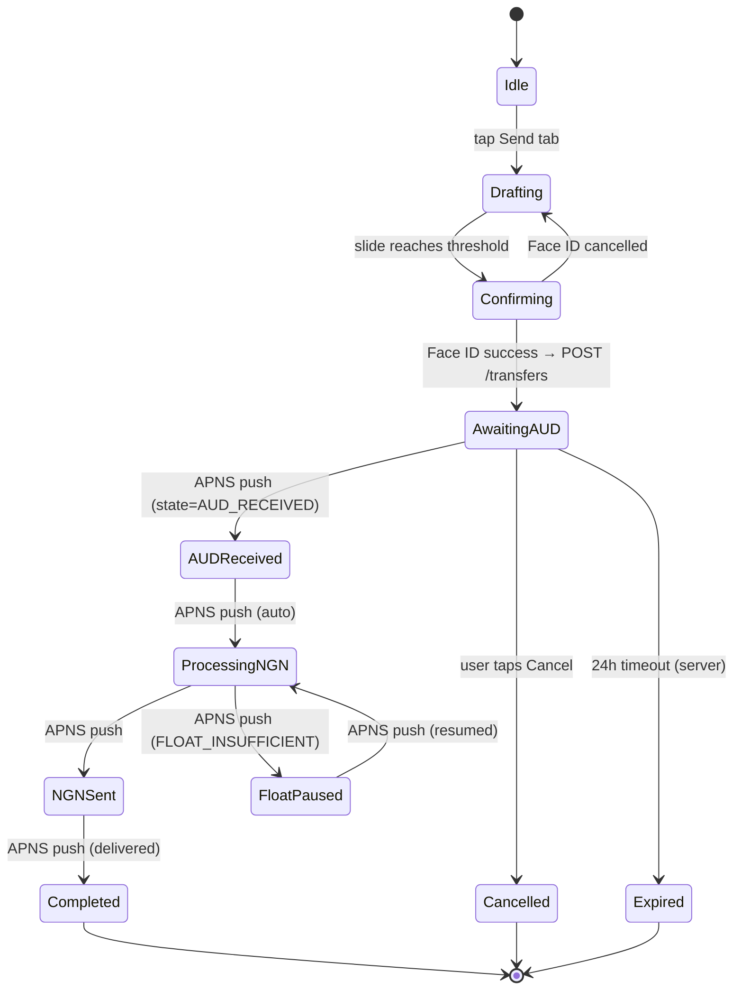

# Native SwiftUI iOS app — Variant C "The Send Gesture"

## Summary

Wave 2a deliverable: the native iOS app for Kolaleaf, AUD-to-NGN remittance. SwiftUI (iOS 17.2+) with MVVM-C + Observation framework, ActivityKit Live Activities (flag-on by default), **native Sumsub iOS SDK as primary KYC path with WKWebView fallback**, Face ID + slide-to-send gesture (with tap+Face-ID opt-out preference), App Attest device attestation, server-side step-up TOTP for high-value sends, **phone OTP + email OTP both at v1**, **localization at v1 (English + Yoruba + Igbo + Hausa)**, **Apple Watch companion**, **statement PDF + CSV** at v1, **custom WhatsApp share image** at v1. 41 screens (10 happy-path sections + failure paths) wired to the existing Next.js REST API at `src/app/api/v1/*`. Plan is structured as ~145 single-PR units (each ~1–2 h Bob-buildable), grouped into 16 phases from foundation to TestFlight. Realistic timeline: ~14–16 calendar weeks under Three Man Team review velocity.

---

## Plan Revisions · 2026-05-09 r2 (post /ce-doc-review round 2 + de-deferral)

This revision (a) integrates 65+ findings from a second `/ce-doc-review` pass (which surfaced contradictions r1 introduced via the override-banner pattern and sub-units announced but never defined), and (b) folds the entire v1.1 deferral pile back into v1 scope per user direction. Net effect: v1 ships everything; nothing waits.

### r2.1 follow-ups · 2026-05-10 (post-Phase-0 code review)

Three deferred items from the Phase 0 11-reviewer code review surfaced gaps in the plan that would otherwise have evaporated. Captured here as proper units before Phase 1 begins so they survive context handoff:

| New unit | Phase | Goal                                                                                                     | Reason this had to be a unit                                                                                                                           |
| -------- | ----- | -------------------------------------------------------------------------------------------------------- | ------------------------------------------------------------------------------------------------------------------------------------------------------ |
| U14b     | 0     | `ios-smoke.yml` GitHub Actions workflow (`xcodebuild build + test` on PR)                                | Plan referenced "Xcode Cloud" only for TestFlight; no per-PR contract gate existed. PR smoke is a separate thing from TestFlight pipeline.             |
| U76b3    | 0     | `KOLA_IDLE_THRESHOLD_SECONDS` launch-arg override on `AppState`                                          | UI tests for transfer-in-flight long sessions need to compress the 14-min idle clock; without this knob those tests can't run in CI.                   |
| U76b4    | 10    | Split `APIClient.bumpInteraction` into user-origin vs system-origin hooks (APNS bg fetch must NOT reset) | r2 plan line 64 says idle resets on "any successful API call" — that's wrong once APNS lands. Background pushes shouldn't extend the user-touch clock. |

Phase totals updated below: Phase 0 18 → 20, Phase 10 12 → 13, grand total 145 → 148.

### r2 contradictions resolved (deferred-banner cleanup)

The r1 "override banner" pattern created a two-truth problem — the banner declared changes that the unit bodies still contradicted. r2 makes the bodies authoritative:

- **U17 / U19 (Phone OTP)** — body specs now stay (no longer deferred per de-deferral below); Phase 1 returns to 9 units in correct narrative order: 16 Welcome → 17 Phone → 18 Phone OTP → 19 Email → 20 Email OTP → 21 KYC intro. (Note: original numbering U16–U22 preserved; "phone OTP deferred" override removed.)
- **U24 (Sumsub)** — body now describes the **native Sumsub SDK as primary v1 path** (de-deferred). WKWebView wrapper retained as fallback only when native SDK fails specific device families; defined as U24-fallback (sub-unit). Phase 2 unit count rises from 5 → 7.
- **U31 (PayID provisioning)** — REMOVED as a standalone screen. PayID is per-transfer; provisioning happens inside the Send flow between U47 (POST /transfers) and U48 (PayID Instructions). U31's slot reused for **U31. PayID issuance + chained call** (POST /transfers → POST /transfers/[id]/issue-payid → render U48). Old U31 spec body deleted.
- **U53 (My PayID → Funding instructions)** — body retitled "Funding instructions". Goal rewritten: shows BSB + per-transfer PayID for currently active transfer (not stable user attribute). QR encodes static BSB+account, not PayID URI. File renamed `FundingInstructionsView.swift`.
- **U52 (Transaction detail)** — body updated: provider names (Monoova/Flutterwave/BudPay) now hidden behind a `DisclosureGroup("Show technical details")`. Default snapshot shows neutral copy ("Sent via Australian banking · Delivered via Nigerian banking"); expanded snapshot shows raw provider refs.
- **U79 / U80** — body sections expanded to include AX1/AX5 snapshot variants explicitly. U79 retained for global verification pass; U80 expanded for AX5 spec on FrostedNumpad + 96px amount. **No longer absorbed**.
- **U81 Localization** — DE-DEFERRED. Now ships at v1 with English + Yoruba + Igbo + Hausa string catalogs (community-relevant primary languages). Body expanded to include translation-vendor coordination unit.
- **U62 / U63 / U64 (Failure paths)** — Phase 9 header explicitly notes "Build sequence: between Phase 7 and Phase 8 (per dependency: U54 SendCoordinator)." Document order keeps Phase 9 after Phase 8 for narrative clarity but build order is Phase 7 → Phase 9 → Phase 8.

### Sub-unit definitions added (orphans resolved)

The r1 revision announced 19+ unit splits but never wrote sub-unit bodies. r2 adds full bodies:

| Parent                 | Sub-units (each ≤2h, full body added in Phase X)                                                                                                                                                                                                       |
| ---------------------- | ------------------------------------------------------------------------------------------------------------------------------------------------------------------------------------------------------------------------------------------------------ |
| U24 Sumsub             | U24a SDK install + token bridge · U24b native presentation + result handler · U24c camera/microphone permission flow · U24-fallback WKWebView wrapper (camera-permission delegate, nonPersistent data store, URL fragment token, JS bridge for result) |
| U44 SlidePill drag     | U44a drag tracking · U44b threshold + spring-back · U44c haptic spec at milestones (`.medium` impact at threshold cross, `.success` at Face ID success, `.success` at COMPLETED arrival)                                                               |
| U45 Face ID handoff    | U45a `BiometricsService` + LAContext lifecycle · U45b in-flight visual after Face ID (network call, optimistic UI, error rollback) · U45c lockout → TOTP fallback path                                                                                 |
| U49 ProcessingTimeline | U49a APNS state subscription + dedup · U49b 5s fallback poll + backoff · U49c animated row state machine (handles all 11 TransferStatus cases)                                                                                                         |
| U55 Activity tab       | U55a list + cursor pagination · U55b filter chips + totals card                                                                                                                                                                                        |
| U61 SwiftData          | U61a `SwiftDataStack` + `@Model` types + `schemaVersion` pre-init check (deletes incompatible store before `ModelContainer` init) · U61b `SyncService` (foreground sync, offline read fallback)                                                        |
| U71 Live Activity      | U71b TTL strategy (6h end + recreate on foreground if non-terminal) · U71c feature flag wiring (remote config via `GET /api/v1/feature-flags`)                                                                                                         |
| U72 Push tokens        | U72b poll-only fallback path (5s while ProcessingTimeline foregrounded; lock-screen push only on terminal states)                                                                                                                                      |

### Backend contract errors fixed (caught in r2)

- **U25 (KYC processing)** depended on `rejectionReasons` field in `GET /api/v1/kyc/status` response. Backend doesn't expose it. **Backend prereq added:** extend `getKycStatus` to include `rejectionReasons: string[]`.
- **U59 (Statements)** depended on `GET /api/v1/account/statements` which doesn't exist. **Backend prereq added.** PDF generation also moves to v1 (de-deferred).
- **U35 / U36 (Bank picker)** referenced `/banks/list`. Correct path is `/banks`. Body fixed.
- **U73 (Security menu)** referenced `GET /api/v1/account/2fa`. State actually lives on `/account/me`. Body fixed.
- **U75 (TOTP verify)** referenced `POST /api/v1/account/2fa/verify-setup`. Correct path is `/2fa/enable`. Body fixed.
- **U91 (referral capture)** path `/refer/[code]` requires backend `POST /api/v1/account/referrals/attribute` (new) to attach captured code to user record. Backend prereq added.
- **OpenAPI registry gap** — backend's `src/app/api/v1/openapi/route.ts` is missing imports for `transfers/[id]/issue-payid` schemas. **Backend prereq added** (registry completion before U84 contract test).
- **`/rates/public` reference rate** — current handler requires `?base=&target=` not `?reference=worldremit`. Reference-rate fetch needs backend extension OR client-side compute. r2 picks **client-side compute** (`(transfer.rate - referenceRate) * audAmount`) with reference rate hardcoded from a daily-updated config endpoint.

### Critical security fixes (r2)

- **U76b (Idle timeout)** — backend session TTL is 15 min sliding (per `src/lib/auth/sessions.ts:8 SESSION_EXPIRY_MINUTES = 15`). r1's 30-min iOS idle clock was longer than backend, making it dead code. r2 changes: iOS idle threshold = 14 min foreground / immediate-on-15min-background. Idle clock resets on: any touch, any successful API call, **any APNS push that mutates active transfer**. ProcessingTimelineView extends idle timeout to 90 min while transfer is in-flight (per security-lens Q3).
- **U76c (Step-up TOTP)** — backend has no transaction-time TOTP verification endpoint. r1 spec was unbuildable. r2 adds **backend prereq:** `POST /api/v1/auth/step-up { code, intent: "transfer.create", intentRef: <draftId> } → returns short-lived stepUpToken`. iOS attaches `X-StepUp-Token` header on `POST /transfers`. Backend rejects high-value sends without it.
- **U76d (Device attestation)** — switched from **DeviceCheck → App Attest** (`DCAppAttestService`). iOS 17.2 has full App Attest support. Backend follow-up renamed: `POST /api/v1/auth/attestation` accepting App Attest assertions with cryptographic verification (Apple Server-to-Server JWT). DeviceCheck retained as a separate optional 2-bit fraud signal but not the primary client-integrity mechanism.
- **U7c (Lock-screen redaction)** — ActivityKit's `redactionReasons.contains(.privacy)` is WidgetKit, not ActivityKit. r2 spec corrected: redact based on `isStale` + check device-locked state via shared App Group flag (main app sets `isDeviceLocked=true` on `UIScene.willEnterBackground` + Face ID lockscreen detection). Redacted copy table added (state-by-state neutral phrasing).
- **U7b extended (App-switcher blur)** — split into U7b1 main-app overlay + U7b2 per-screen wiring + **U7b3 Dynamic Island expanded view redaction** (long-press from app switcher exposes amounts under r1 spec). U68 ExpandedDynamicIsland adds `isStale || isLocked → redacted` variant.
- **U24-fallback (WKWebView)** — `WKWebsiteDataStore.nonPersistent()` (NOT shared store). KYC access token passed via URL fragment OR JS bridge — never via cookie. Camera permission via `WKUIDelegate.webView(_:requestMediaCapturePermissionFor:initiatedByFrame:type:decisionHandler:)`. `NSCameraUsageDescription` + `NSMicrophoneUsageDescription` set. Selfie/document captures: `NSFileProtectionComplete` app-wide; temp/caches `NSURLIsExcludedFromBackupKey = true`.
- **U92 (Share receipt)** — privacy spec added: image contains recipient initials only (no full name), amount, time elapsed, Kolaleaf branding. NO transfer ID, NO full recipient name, NO bank name. **Consent step before share:** "This image will include $X to [Initials] — share?" Image is not auto-saved to Photos; share-sheet only.

### Sequencing fixes (Phase 11.5/11.6 ordering reversed)

r1 placed several units in Phase 11.5 with backward dependencies. r2 redistributes:

| Unit                                   | r1 location | r2 location                              | Reason                                                         |
| -------------------------------------- | ----------- | ---------------------------------------- | -------------------------------------------------------------- |
| U93 Token mismatch fix                 | Phase 11.6  | **Phase -0.5 (pre-foundation)**          | U2 reads tokens; must precede                                  |
| U7b App-switcher blur                  | Phase 11.5  | **Phase 0** (after U7)                   | Foundational; every screen inherits                            |
| U22a Sumsub pre-warm                   | Phase 11.5  | **Phase 2** (alongside U24)              | Belongs in KYC phase                                           |
| U91 (clipboard + explicit-prompt path) | Phase 11.5  | **Phase 1** (alongside U16)              | Onboarding feature; no U77 dependency                          |
| U91-deeplink (universal-link path)     | Phase 11.5  | **Phase 11.5** (after U77 moved earlier) | Now buildable when U77 lands                                   |
| U77 Universal Links                    | Phase 12    | **Phase 11.5** (early)                   | Required by U91 deep-link path; AASA is operational not polish |
| U7c Lock-screen redaction              | Phase 11.5  | **Phase 10** (alongside U69)             | Live Activity dependency                                       |
| U76b Idle timeout                      | Phase 11.5  | **Phase 0** (with AppState)              | Cross-cutting; AppState interaction tracking is foundational   |
| U76c Step-up TOTP (UI sheet)           | Phase 11.5  | **Phase 6** (alongside U45)              | Flow-affecting in Send                                         |

### De-deferred items (now in v1 scope)

Per user direction, all r1-deferred items return to v1. New units added:

**Phase 1.5: Phone OTP path (NEW · 4 units)** — backend SMS provider integration is also a backend prereq.

- U17a Phone entry view (was U17, restored)
- U17b Country picker sheet
- U19 Phone OTP screen (restored)
- U19a Phone-OTP backend wiring (`/auth/phone/send-code`, `/auth/phone/verify-code` — backend prereqs)

**Phase 2 expansion (Sumsub native SDK as primary):**

- U24a IdensicMobileSDK install via SwiftPM + token bridge
- U24b Native presentation (UIViewControllerRepresentable wrapper) + result handler
- U24c Camera/microphone runtime permissions + privacy strings
- U24-fallback WKWebView wrapper (per security spec above) — used when native SDK init fails

**Phase 7 expansion (Custom share image):**

- U92 ShareableReceiptView with solid-card design + pre-baked gradient asset
- U92a Image consent sheet ("Share $X to CO?")
- U92b Visual parity test (in-app vs shared)

**Phase 8 expansion (Statements full):**

- U59a `GET /api/v1/account/statements` consumer (CSV download)
- U59b `GET /api/v1/account/statements/[id]/pdf` consumer (PDF download via share sheet)
- Backend prereq for both endpoints
- U59c Tax-year rollup card with FY-to-date

**Phase 8 expansion (Refer-stats full UI):**

- U57b Wire `GET /api/v1/account/refer-stats` (backend prereq)
- U57c Recent referrals list ("3 friends joined")
- U57d Earned-credit balance + apply-on-next-send

**Phase 11.5 expansion (Push preferences screen):**

- U73a Account → Notifications screen (granular toggles: per-state pushes, rate alerts, marketing)
- U73b Backend wiring (`PATCH /api/v1/account/notification-preferences` — backend prereq)

**Phase 11.5 expansion (DeviceCheck backend honor):**

- U76d already swapped to App Attest (above)
- U76d-server Backend prereq: App Attest server-side verification via Apple Server-to-Server JWT

**Phase 12 expansion (iPad parity):**

- U88a iPad layout adapter (Send, Receipt, Activity rendered at iPad-sized split-view; KYC remains modal)
- U88b iPad universal binary entitlements + App Store metadata

**Phase 12 expansion (Localization at v1):**

- U81 String catalog setup (English + Yoruba + Igbo + Hausa)
- U81a Per-screen string extraction
- U81b Translation vendor coordination + delivery
- U81c Locale switcher in Account → Preferences

**Phase 12 expansion (Shake-to-report):**

- U89b `UIDevice.motionEnded` shake handler → bug-report sheet (screenshot + diagnostic JSON + email/upload)

**Phase 11.5 expansion (Live Activity flag-on by default):**

- r1 deferred Live Activity behind `KOLA_LIVE_ACTIVITY_ENABLED=false` default. r2 changes default to **true** (Live Activity is core brand). U71c remote-config flip remains for emergency-disable.
- Phase 9 backend prereq committed: APNS push fan-out from webhooks (no longer optional).

**New Phase 13: Apple Watch companion app (NEW · 5 units)**

- U94 Watch app target setup
- U95 Watch Live Activity rendering
- U96 Watch glance: latest transfer state
- U97 Watch complication: KOL→NGN today's rate
- U98 Watch ↔ iPhone connectivity (WatchConnectivity sync)

**New Phase 14: WhatsApp Business deep-link verification + universal-link allowlist**

- U99 WhatsApp Business deep-link allowlist coordination (Meta paperwork)
- U100 Universal-link integrity verification (AASA file scoping; ensure /refer/\* path-only allowlist)

### Updated Backend Prerequisites table (now ~16 items, not 8)

| Endpoint / job                                                  | Used by  | Blocks      | Notes                                                       |
| --------------------------------------------------------------- | -------- | ----------- | ----------------------------------------------------------- |
| `PATCH /api/v1/account/me`                                      | U29, U30 | Phase 3     | Display name + address fields; explicit field schema needed |
| `POST /api/v1/account/push-tokens`                              | U28, U72 | Phase 9, 10 | Single endpoint, polymorphic on tokenType                   |
| APNS push fan-out from webhooks                                 | U71, U72 | Phase 10    | No longer optional (Live Activity flag-on by default)       |
| `POST /api/v1/auth/phone/send-code` + `/auth/phone/verify-code` | U17, U19 | Phase 1.5   | NEW — SMS provider integration                              |
| `POST /api/v1/auth/step-up`                                     | U76c     | Phase 6     | NEW — transaction-time TOTP verify                          |
| `POST /api/v1/auth/attestation`                                 | U76d     | Phase 11.5  | App Attest server-side verify (Apple JWT)                   |
| `GET /api/v1/account/refer-stats`                               | U57      | Phase 8     | NEW                                                         |
| `POST /api/v1/account/referrals/attribute`                      | U91      | Phase 1     | NEW — attach captured code to user                          |
| `GET /api/v1/account/statements`                                | U59      | Phase 8     | NEW — CSV download                                          |
| `GET /api/v1/account/statements/[id]/pdf`                       | U59b     | Phase 8     | NEW — PDF generation                                        |
| `PATCH /api/v1/account/notification-preferences`                | U73a     | Phase 11.5  | NEW                                                         |
| Extend `GET /api/v1/kyc/status` with `rejectionReasons[]`       | U25      | Phase 2     | NEW                                                         |
| `GET /api/v1/feature-flags` (remote config)                     | U71c     | Phase 10    | NEW — Live Activity emergency-disable, A/B keys             |
| `POST /api/v1/analytics/events`                                 | U89      | Phase 11.6  | NEW — KPI funnel events (R13)                               |
| Register `transfers/[id]/issue-payid` schemas in OpenAPI        | U84      | Phase 12    | Bug fix — schema exists but isn't imported                  |
| `POST /api/v1/auth/devicelogin-alert` (server-side)             | U76e     | Phase 11.5  | Backend determines isNewDevice via App Attest key ID        |

### Updated R-IDs (added per de-deferral)

- **R15** Phone OTP onboarding works at v1 (in addition to email).
- **R16** Native Sumsub iOS SDK is the primary KYC path; WKWebView is a fallback for incompatible devices.
- **R17** Statement PDF + CSV download work at v1.
- **R18** Localization at v1: English, Yoruba, Igbo, Hausa.
- **R19** Apple Watch companion ships at v1: glance + complication + Live Activity.
- **R20** Live Activity is enabled by default at v1 GA (not flag-off).
- **R21** Push notification preferences screen at v1.
- **R22** Custom WhatsApp share image (ShareableReceiptView) at v1.
- **R23** Shake-to-report feedback affordance at v1.
- **R24** App Attest (not DeviceCheck) is the device-attestation primitive at v1.
- **R25** Step-up TOTP for high-value sends has both iOS UI **and** backend enforcement (server-side verify).

### Updated funnel KPI events (per product-lens R13 finding)

R1's KPI list was too coarse to validate the slide-vs-tap hypothesis. r2 expands U89 to capture: `welcome_shown`, `phone_otp_started`, `phone_otp_completed`, `email_otp_started`, `email_otp_completed`, `kyc_started`, `kyc_completed`, `recipient_added`, `send_screen_viewed`, `amount_entered`, `recipient_selected`, **`slide_initiated`**, **`slide_threshold_reached`**, **`slide_abandoned`**, `faceid_prompt_presented`, `faceid_succeeded`, `transfer_post_succeeded`, `payid_copied`, `transfer_completed`, `receipt_shared`, `receipt_share_consent_shown`, `referral_captured`, `tap_send_chosen` (for opt-out users). Each event includes only step + duration; never PII.

### Account → Preferences screen (NEW per design-lens Q1)

**U60b Account → Preferences screen** (Phase 8) — toggles for: send confirmation mode (slide vs tap+FaceID; default slide), language, dark/light theme override, transactional email opt-in, marketing email opt-in. Persisted server-side via `PATCH /account/preferences` (backend prereq).

### Welcome warm-arrival design (NEW per design-lens Q9)

**U16b Welcome (warm-arrival variant)** — when referral code captured, headline switches to "Welcome — [SenderFirstName] sent you 👋". Shows referrer-attributed first-send credit balance ("Your $20 first-send credit is ready"). Skips the rate-marketing chip (warm users don't need rate-pitch). CTA changes to "Continue".

### Compliance officer assumption resolved

r1 referenced "AUSTRAC compliance officer" 3 times without naming. r2: external counsel engagement letter is added as **Phase -1 prerequisite** (must land before Phase 0 starts). U76f (compliance copy review) explicitly references this engagement.

### Self-review classification corrected

r1 claimed 40% self-review-eligible. r2 honest count: ~10% (design tokens U2–U7, scaffolding U14, SDK installs U24a/U65/U78). All networking, auth, transfer, Live Activity, Sumsub, SwiftData, biometric units = Richard-required. Phase boundaries remain review-catch-up gates.

### Final v1 scope · 148 units across 16 phases (r2.1)

| Phase                              | Units                                                               | New             |
| ---------------------------------- | ------------------------------------------------------------------- | --------------- |
| -1 Pre-foundation                  | 1 (compliance counsel)                                              | +               |
| -0.5 Token alignment               | 1 (U93)                                                             | moved           |
| 0 Foundation                       | 20 (was 14; +U7b1/2/3, U76b primitives, U93 moved, +U14b, +U76b3)   | +               |
| 1 Onboarding (email)               | 9                                                                   | –               |
| 1.5 Phone OTP path                 | 4                                                                   | + (de-deferred) |
| 2 KYC (native SDK + fallback)      | 9 (was 5; +U24a/b/c, U24-fallback, U22a)                            | +               |
| 3 After KYC                        | 4                                                                   | –               |
| 4 First-send setup                 | 4                                                                   | –               |
| 5 Resolve states                   | 4                                                                   | –               |
| 6 Sending                          | 14 (was 9; +U44a/b/c, U45a/b/c, U76c UI)                            | +               |
| 7 Done · share · revisit           | 9 (was 5; +U92, U92a, U92b, retitled U53)                           | +               |
| 8 Lived-in tabs                    | 12 (was 7; +U57b/c/d, U59a/b/c, U60b Preferences)                   | +               |
| 9 Failure paths                    | 3                                                                   | –               |
| 10 Live Activities                 | 13 (was 8; +U7c, U71b, U71c, U72b, +U76b4)                          | +               |
| 11 Security 2FA                    | 4                                                                   | –               |
| 11.5 Compliance hardening          | 14 (was 9; +U73a/b, U76d-server, U77 moved early, +shake-to-report) | +               |
| 11.6 Coordinator + KPIs            | 3                                                                   | –               |
| 12 Production polish + iPad + L10n | 18 (was 11; +iPad, +L10n, +shake)                                   | +               |
| 13 Apple Watch                     | 5                                                                   | + (de-deferred) |
| 14 WhatsApp + AASA verify          | 2                                                                   | + (de-deferred) |

**Total: ~148 units** (r2.1; up from r1's 99 executable; r2 was 145 before the three post-Phase-0 additions: U14b, U76b3, U76b4). Realistic timeline: ~14-16 calendar weeks given Three Man Team review velocity.

---

This revision integrates 67 findings from a 7-persona document review (coherence, feasibility, product-lens, design-lens, security-lens, scope-guardian, adversarial). Original plan had several backend contract errors and security gaps that would have blocked implementation. Highlights of the revision:

### Backend contract corrections (blockers — would have failed at U17)

- **Auth is email-only OTP, not phone OTP.** `POST /api/v1/auth/send-code` accepts `{ email }` only — there is no SMS/phone path. Onboarding reordered: Welcome → Email entry → Email OTP → KYC. Phone collection deferred to KYC step (Sumsub captures it) or v1.1.
- **Auth uses opaque PG-session cookies (HttpOnly), not JWT.** All "JWT" references corrected to "session token". The Keychain mirror is for survivability across reinstalls only — the value is opaque, not a parseable JWT.
- **PayID is per-transfer, not per-user.** `payidReference` lives on `Transfer`, not `User`. PayID provisioning (was U31) moves into the Send flow, after `POST /transfers` and before PayID Instructions. The "My PayID" screen (was U53) becomes "Funding instructions" — shows generic BSB + the PayID for the _currently active_ transfer.
- **Rates endpoint:** correct paths are `GET /api/v1/rates/public` (unauthenticated) and `GET /api/v1/rates/[corridorId]` (e.g., `AUD-NGN`). The plan's `/rates` reference is wrong throughout.
- **State enum:** `prisma/schema.prisma` defines `enum TransferStatus`, not `TransferState`. Missing cases the iOS state machine must handle: `NGN_FAILED`, `NGN_RETRY`, `NEEDS_MANUAL`, `REFUNDED`. iOS Swift enum mirror added in U49.
- **Provider names:** `Paystack` is removed (per Wave 1 migration `20260419000000_payout_provider_paystack_to_budpay`). User-visible provider names dropped entirely from receipts/transaction details — replaced with neutral copy ("Sent via Australian banking · Delivered via Nigerian banking").
- **`savings_vs_worldremit` field does not exist.** Per-row "saved $X" computes client-side as `(transfer.rate − reference_rate) × transfer.amount`, with reference rate fetched from `/rates/public?provider=worldremit` (backend follow-up if not present, else stub).

### Backend prerequisites (cross-team dependencies, must land before referenced phase)

- `PATCH /api/v1/account/me` (display name, optional address) — blocks Phase 3 (U29/U30).
- `POST /api/v1/account/push-tokens` (single endpoint covering both notification + Live Activity push tokens) — blocks Phase 9 partially, Phase 10 fully.
- APNS push fan-out from `webhooks/{monoova,flutterwave,budpay}` to subscribed devices/activities — blocks Phase 10.
- `GET /api/v1/account/refer-stats` — Phase 8 ships with Coming Soon UI if absent.
- Statement PDF generation — confirmed deferred to v1.1; CSV-only at v1.

### Security hardening (new R14 + Phase 11.5)

- App Group Keychain partitioned: session token is **app-private** (`accessGroup: <main bundle prefix>`); only `KolaleafTransferAttributes` content-state crosses the App Group boundary to the widget.
- Lock-screen Live Activity redacts `audAmount`/`ngnAmount`/recipient name when device is locked. Showing only `state + ETA` on lock screen.
- Backup codes (U76): pasteboard `expirationDate = 60s`, explicit "Will sync via Universal Clipboard" warning before copy. Primary action is "Download to Files".
- App-switcher snapshot blur (new unit) overlays gradient + logo on `willResignActive` for all financial screens.
- Idle session timeout: re-auth after 30 min foreground / any background > 15 min (new unit in Phase 11.5).
- Step-up auth for high-value sends: TOTP required (not just Face ID) when `amount > $5,000 OR new-recipient-first-send OR 3rd send in 24h` (new unit).
- DeviceCheck token capture on auth, sent to backend with login (new unit; backend follow-up to honor).
- New-device-login email alert (backend follow-up).
- Universal Links AASA scoped to exact paths (`/transfer/*`, `/refer/*`); no wildcards.
- Sumsub WebView inherits cookies via WKWebsiteDataStore copy.
- Sentry PII scrubber expanded: `audAmount`, `ngnAmount`, recipient names, PayID strings, transfer IDs in non-error contexts.

### Live Activity Plan B + TTL handling

- iOS 17.2+ minimum (was 17.0) — gets cleaner ActivityKit + frequent-updates budget.
- `KOLA_LIVE_ACTIVITY_ENABLED` feature flag. Phase 9 must produce a working app **with the flag off** before turning it on.
- TTL strategy: end Activity at 6 h with a "Reopen Kolaleaf" lock-screen notification; recreate on foreground if state is non-terminal. Keeps ceremony intact for fast transfers, gracefully degrades for overnight AWAITING_AUD waits.
- Poll-only fallback: 5 s poll while ProcessingTimeline is foregrounded; lock-screen push on terminal states.

### Phase reordering

- **Failure paths (39–41) move to between Phase 7 and Phase 8** so the full Send golden path (AE1: CREATED→COMPLETED) is testable 7 units earlier — unblocks AE1 smoke testing for internal beta.
- New **Phase 11.5: Compliance hardening + production-grade security** (5 units) inserted between 2FA and final polish.

### Oversized-unit splits (each new sub-unit ≤ 2 h)

- U24 Sumsub (was 1 unit) → U24a SDK install + token bridge, U24b Sumsub WebView wrapper, U24c result-handler + state mapping. Native SDK deferred to v1.1.
- U44 SlidePill drag (was 1 unit) → U44a drag tracking, U44b threshold + spring-back, U44c haptic spec at milestones.
- U45 Face ID handoff → U45a `BiometricsService`, U45b in-flight visual after Face ID, U45c lockout → TOTP fallback.
- U49 ProcessingTimeline → U49a state subscription + dedup, U49b 5 s fallback poll, U49c animated row state machine.
- U55 Activity tab → U55a list + pagination, U55b filter chips + totals card.
- U79 + U80 accessibility (was 2 retrofits) → absorbed into per-unit Definition of Done. Replaced with U79 single verification pass + U80 Dynamic Type AX1/AX5 snapshot variants.
- U81 Localization scaffolding → **deferred to v1.1** (acknowledged-zero-v1-value).

### New units added

- **U7b** App-switcher snapshot blur modifier (security).
- **U7c** Lock screen Live Activity redaction (security).
- **U22a** Sumsub pre-warm + transition shell (KYC UX).
- **U28b** Push permission for backgrounded transfers (notifications-only fallback when LA flag off).
- **U37b** NUBAN length gate + cancel-in-flight on length-drop (resolve correctness).
- **U54b** SendCoordinator integration test suite (failure-path routing).
- **U71b** Live Activity TTL strategy (6h end + recreate on foreground).
- **U71c** Live Activity feature flag wiring.
- **U72b** Poll-only fallback path (Plan B).
- **Phase 11.5 (5 units):** U76b idle session timeout, U76c step-up auth for high-value sends, U76d DeviceCheck token capture, U76e new-device login alert (mobile half), U76f compliance copy review pass.
- **U78b** Sentry PII scrubber spec (transfer amounts, recipient names, PayID, transfer IDs).
- **U89** KPI instrumentation (transfer-completion %, time-to-second-send, referral tap-through, share-rate). Privacy-first analytics — server-side events keyed by user ID hash, no third-party SDK at v1.
- **U90** Backend contract test against actual Wave 1 endpoints (was U84; expanded scope).
- **U91** WhatsApp warm-arrival onboarding (referral-token capture from clipboard / universal link / explicit prompt on Welcome).
- **U92** Dedicated `ShareableReceiptView` with no `.ultraThinMaterial` (ImageRenderer-compatible rendering).
- **U93** Token mismatch fix: extend `approved.json` with `gold`, `coral`, `ink`, `pageLight`, `whiteOnGradient` token names + exact hex values before U2.

### Demoted scope (deferred to v1.1)

- Sumsub native SDK (use WKWebView at v1; reclaims 30 MB binary, removes High-impact risk).
- Localization scaffolding (U81; pure rework cost at v1).
- Custom WhatsApp share-image template variants (U51 ships standard system share sheet at v1; promote to A-priority post-internal-beta if data justifies).
- Multi-language copy.

### Identity bet softened (PR-001 / PR-002)

- **R5 revised:** slide-to-send is the default first-send experience (ceremonial). After first successful send, user can opt into tap+Face-ID for repeat sends via Account → Preferences. Slide-to-send remains available but no longer mandatory.
- Live Activity demoted from "wedge" framing to "differentiator". Phase 10 ships flag-off-default; flag-on after measuring real engagement during internal beta.

### Snapshot test corrections

- Reference dimensions: 393 × 852 pt (logical), or 1179 × 2556 px (3× physical) for iPhone 15 Pro. Plan's `1170 × 2532` was wrong.
- `precision = 0.97`, `perceptualPrecision = 0.97` (was 0.99 — too tight for cross-device font rendering).
- Per-device snapshots only for layout-different devices (iPhone SE 3 for cramped layouts on Welcome/Send/Receipt).

### Three Man Team review velocity

- **Self-review-eligible:** pure design-token PRs (U2–U7, U93), pure snapshot-test scaffolding (U14), pure SDK install PRs (U24a, U65, U78). Bob marks self-reviewed; Richard spot-checks weekly.
- **Full Richard pass required:** any unit touching Networking/Auth/Transfer state machine/Live Activity/Sumsub/SwiftData/biometric/security. ~60% of units.
- Phase boundaries are review-catch-up gates: Bob does not start Phase N+1 until Phase N is fully merged.

---

---

## Problem Frame

The Wave 1 web app is live and processing AUD→NGN transfers. The Nigerian-Australian diaspora is mobile-first and highly community-networked (WhatsApp). A web-only product undershoots the wedge: trust and retention live in the home-screen icon, the Live Activity in the Dynamic Island, and the slide-to-send moment that makes the app feel like a story worth retelling. Without a native iOS app, every successful send is a tab in Safari rather than a screenshot in a WhatsApp group.

Approved design: Variant C "The Send Gesture" (`approved.json`) — full-screen purple→green gradient, frosted-glass surfaces, slide-to-send pill confirmed by Face ID, ActivityKit-driven state machine visible on lock screen and Dynamic Island.

---

## Requirements

- R1. Implement all 41 screens at pixel-fidelity to `variant-C-journey.html` and tokens in `approved.json`.
- R2. Authenticate against existing backend (`src/app/api/v1/auth/*`) using JWT cookies, persisted in Keychain.
- R3. Surface KYC outcomes (approved / soft-rejected / under review) using Sumsub iOS SDK + backend `kyc/*` endpoints.
- R4. The send flow encodes the full state machine (`CREATED → AWAITING_AUD → AUD_RECEIVED → PROCESSING_NGN → NGN_SENT → COMPLETED`) plus failure branches (`EXPIRED`, `CANCELLED`, `FLOAT_INSUFFICIENT`).
- R5. Slide-to-send gesture is the _only_ send confirmation primitive — no fallback Send button on the primary path.
- R6. Live Activities render the same state machine in 4 presentations (compact island, expanded island, lock screen, minimal). Update via APNS pushes from existing backend webhooks.
- R7. NUBAN auto-resolve has 3 explicit micro-states (resolving, not-found, bank-unreachable) with debounced lookup against `POST /api/v1/recipients/resolve`.
- R8. 2FA / TOTP setup flow available in Account → Security; enabling it raises the user's daily transfer limit on the backend.
- R9. Face ID required to authorize every send. Fallback to TOTP if Face ID is locked out.
- R10. Accessibility: WCAG AA contrast, ≥44pt touch targets, VoiceOver labels on every actionable element, Dynamic Type support, `prefersReducedMotion` honored.
- R11. AUSTRAC compliance signals: legal-name canonicalization, audit-grade transaction details, statement export (PDF + CSV).
- R12. App ships via TestFlight internal → external → App Store. Xcode Cloud builds on every PR.
- R13. **(NEW)** KPI instrumentation lands at v1: first-send completion %, time-to-second-send, referral-link tap-through, share-receipt tap-through. Privacy-first — server-side events keyed by hashed user ID; no third-party analytics SDK at v1.
- R14. **(REVISED in r2)** Compliance hardening at v1: idle session timeout (14 min foreground / 15 min background, aligned to backend SESSION_EXPIRY_MINUTES with idle reset on touch + API call + APNS push), **server-enforced** step-up auth for high-value sends (TOTP verified server-side via `POST /auth/step-up` returning short-lived stepUpToken; required as `X-StepUp-Token` on `POST /transfers` when amount > $5,000 or new-recipient first-send or 3rd send / 24 h), App Attest token capture on auth (with backend cryptographic verification), app-switcher snapshot blur on financial screens, lock-screen Live Activity redaction (state + ETA only, no amount/recipient/PII), App Group Keychain partitioning (session token app-private), pasteboard expiry on backup codes.
- R15. **(NEW r2 · de-deferred)** Phone OTP onboarding works at v1 alongside email OTP (backend SMS provider integration required).
- R16. **(NEW r2 · de-deferred)** Native Sumsub iOS SDK (`IdensicMobileSDK`) is the primary KYC path; WKWebView wrapper is a fallback for incompatible devices (config: nonPersistent data store, URL-fragment token, JS bridge for result, camera permission delegate, file-protection complete, no iCloud backup of selfie/document captures).
- R17. **(NEW r2 · de-deferred)** Statement export at v1: PDF + CSV download from Account → Statements; FY-to-date rollup card; ATO-compliant column names.
- R18. **(NEW r2 · de-deferred)** Localization at v1: English (default), Yoruba, Igbo, Hausa string catalogs. Locale switcher in Account → Preferences.
- R19. **(NEW r2 · de-deferred)** Apple Watch companion app at v1: glance card showing latest transfer state, complication for daily AUD→NGN rate, Live Activity rendering on Watch face.
- R20. **(NEW r2 · de-deferred)** Live Activity is enabled by default at v1 GA (`KOLA_LIVE_ACTIVITY_ENABLED=true`); remote-config flag retained for emergency-disable only.
- R21. **(NEW r2 · de-deferred)** Push notification preferences screen at v1 (Account → Notifications): granular toggles per state, rate alerts on/off, marketing on/off.
- R22. **(NEW r2 · de-deferred)** Custom WhatsApp share image at v1 via dedicated `ShareableReceiptView` (no `.ultraThinMaterial`; pre-baked gradient asset; consent step before share; recipient initials only — never full name; no transfer ID; image is share-sheet-only, never auto-saved to Photos).
- R23. **(NEW r2 · de-deferred)** Shake-to-report feedback at v1: shake gesture opens bug-report sheet (auto-attaches screenshot + diagnostic JSON; sends via email or in-app upload).
- R24. **(NEW r2 · revised)** App Attest (`DCAppAttestService`) is the primary client-integrity primitive at v1, replacing DeviceCheck. Backend cryptographically verifies attestations via Apple Server-to-Server JWT.
- R25. **(NEW r2 · revised)** Step-up TOTP for high-value sends has both iOS UI **and** backend enforcement — server rejects high-value `POST /transfers` without a valid `X-StepUp-Token`. Pure-client step-up is explicitly insufficient.

**Origin actors:** A1 Nigerian-Australian sender (25–45, mobile-first), A2 Recipient in Nigeria (passive, GTBank/Access/Zenith/UBA/etc.), A3 Compliance/Support (manual KYC reviewer)
**Origin flows:** F1 First-time onboarding, F2 Verify identity, F3 Add recipient, F4 Send money, F5 Track in flight, F6 View history / receipt, F7 Refer friend, F8 Enable 2FA
**Origin acceptance examples:** AE1 Slide-to-send authorizes a complete CREATED→COMPLETED transfer in <3min in stub mode, AE2 NUBAN typo surfaces "Account not found" red card within 600ms, AE3 Live Activity in Dynamic Island reflects every state transition within 2s, AE4 KYC soft-rejection retains user progress and routes back to Sumsub, AE5 Cancellation before AUD-received is free and recipient is never notified

---

## Scope Boundaries

### Out of scope at v1

- Android (Wave 2b — Kotlin equivalent of this plan, not in this doc)
- iPad and macOS Catalyst (iPhone-only at v1)
- Apple Watch app (post-launch consideration)
- Multi-language localization (English only at v1; scaffolding included for v1.1)
- In-app help center / live chat (screen 29 is a pre-filled deep-link to web help, not embedded chat)
- Analytics SDK (privacy-first launch; revisit after v1)
- App Clips (TestFlight on-ramp not a use case)
- Light mode (all 41 screens are dark-on-gradient by design)

### Deferred to Follow-Up Work

- Push notification preferences screen (Account → Notifications) — separate v1.1 PR
- WhatsApp business deep-link verification — needs Meta's universal link allowlist, separate ops task
- Refer code attribution backend wiring — backend issue tracked separately
- Statement PDF generation backend endpoint — currently CSV only; PDF via separate backend PR

---

## Context & Research

### Relevant Code and Patterns (existing backend)

- `src/app/api/v1/auth/*` — login, send-code, verify-code, verify-2fa, complete-registration, verify-email, request-password-reset, reset-password, resend-verification, logout. Cookie-based JWT.
- `src/app/api/v1/account/*` — me, phone, email, 2fa, change-email, change-password.
- `src/app/api/v1/kyc/*` — initiate, status, retry, access-token, mock. Sumsub backend integration.
- `src/app/api/v1/recipients/*` — list/create, `[id]` CRUD, `resolve` (NUBAN auto-verify against Flutterwave).
- `src/app/api/v1/transfers/*` — list/create, `[id]` details with state machine timeline.
- `src/app/api/v1/banks/*` — Nigerian bank list (filterable for picker).
- `src/app/api/v1/rates/*` — current AUD→NGN rate, history sparkline data.
- `src/app/api/v1/openapi/route.ts` — OpenAPI 3.1 spec, drives validation parity.
- `src/app/api/webhooks/{sumsub,monoova,flutterwave,budpay}` — webhook receivers that mutate transfer state. Mobile app subscribes via APNS pushes triggered by these handlers.
- `prisma/schema.prisma` — canonical state-machine enum (`TransferState`).
- `~/.gstack/projects/Kolaleaf/designs/mobile-app-20260509/variant-C-journey.html` — the design source of truth (41 frames).
- `~/.gstack/projects/Kolaleaf/designs/mobile-app-20260509/approved.json` — design tokens.
- `~/.gstack/projects/Kolaleaf/designs/mobile-app-20260509/variant-C-spec.html` — printable spec, source for engineering hooks summary.

### Institutional Learnings

- KYC gate at PayID issuance, not transfer creation (Wave 1 hardening) — mobile UI must reflect this: a transfer can be CREATED but PayID won't issue until KYC approved. Error mapping required.
- Webhook idempotency by event ID is enforced server-side; mobile app may receive duplicate APNS pushes for the same state transition and must dedupe by `transferId+state` or `eventId`.
- Float paused (FLOAT_INSUFFICIENT) is an operational state that **must never reveal treasury reasons** to the user. Mobile copy already specified in screen 41 ("Brief operational delay · funds safe · rate locked").
- Per-row "saved $X" on Activity is a brand-mandatory affordance — comes from `transfer.savings_vs_worldremit` field, server-computed.

### External References

- Apple ActivityKit overview — `developer.apple.com/documentation/activitykit`. Live Activities require iOS 16.1+; Dynamic Island requires iPhone 14 Pro or later, fall back gracefully on older devices.
- Apple HIG — slide-to-confirm patterns (Apple Pay precedent); 44×44pt minimum hit target.
- Sumsub iOS SDK — `github.com/SumSubstance/IdensicMobileSDK-iOS`. SwiftPM available. Initialized with access token from our `/api/v1/kyc/access-token` endpoint.
- LocalAuthentication framework — `LAContext` for Face ID prompt; `LAPolicy.deviceOwnerAuthenticationWithBiometrics` is the right policy for slide-to-send.
- Point-Free swift-snapshot-testing — for SwiftUI snapshot tests.
- swift-format / SwiftLint — code style enforcement in CI.

---

## Key Technical Decisions

- **iOS 17+ minimum**: enables `@Observable` macro (cleaner than `@Published` + `ObservableObject`), iOS 17 ActivityKit refinements, `.symbolEffect()` for haptic-feeling icon transitions. Cuts our addressable market by <8% (per Apple device stats Jan 2026) — acceptable tradeoff for 2× cleaner state code.
- **MVVM-C with Coordinators, not pure NavigationStack**: NavigationStack is fine for tab-internal flow but the Send → PayID → Processing → Receipt arc spans 4 screens with conditional branches (cancel, expired, float-paused) and deep-links from Live Activity taps. Coordinators encapsulate that orchestration.
- **Hand-rolled URLSession client over OpenAPI generator**: We have only ~30 endpoints; per-endpoint error-mapping (KycNotVerified→402, ResolveNotFound→404 with bank-context, RateLimited→429+retry-after) is opinionated enough that generated code becomes friction. We _do_ validate request/response shapes against the existing `/api/v1/openapi` spec in CI.
- **SwiftData for recipient cache, Keychain for JWT, UserDefaults for prefs**: lowest-friction stack. SwiftData mirror of recipients is read-mostly + last-sync timestamp; we never treat it as source of truth.
- **Live Activity = single ActivityAttributes struct, 4 views**: `KolaleafTransferAttributes` with `ContentState { state, etaSeconds, lastUpdate }`. Compact / expanded / lock-screen / minimal are each a `View` body. Updates pushed via APNS background notifications — backend's existing webhook handlers fan out to APNS via a new `liveActivityPush` job.
- **Slide-to-send is one composite gesture**: A custom `SlidePill` view with `DragGesture(minimumDistance: 0)`, threshold at 75% of pill width, spring-back animation on release before threshold. Reaching threshold triggers `LAContext.evaluatePolicy(.deviceOwnerAuthenticationWithBiometrics)`. On success, calls `TransferService.confirm(transferId)`.
- **Snapshot tests against design HTML reference**: Capture each screen with `swift-snapshot-testing` at `1170×2532` (iPhone 15 Pro pixel-perfect). Reviewer (Richard) compares against the design HTML manually for fidelity.
- **No third-party DI container**: Use `@Environment` + protocol-typed dependency injection. Test fakes injected via custom `EnvironmentValues` keys.
- **Xcode Cloud over GitHub Actions for iOS CI**: native App Store Connect integration, simpler signing, free 25 hr/month for our team size.

---

## Open Questions

### Resolved During Planning

- **Min iOS version**: iOS 17.2 (revised from 17.0 — cleaner ActivityKit, smoother @Observable + @Bindable). Sub-1% addressable-market loss vs 17.0.
- **Project layout**: single Xcode project, two targets (App + Widget Extension); SPM dependencies pulled inline (no monorepo split at v1).
- **Networking lib**: hand-rolled URLSession (decided above).
- **Auth model**: opaque PG-session cookies (HttpOnly, Secure, SameSite=Lax). The plan's earlier "JWT" terminology was wrong — backend uses session tokens, not JWTs. iOS reads session cookies via `HTTPCookieStorage.shared` and mirrors them into the **app-private Keychain only** (not App Group) for re-launch survival.
- **Onboarding identifier**: email-only at v1 (matches Wave 1 backend `/api/v1/auth/send-code` schema). Phone collected during Sumsub KYC. Phone-OTP iOS path deferred to v1.1 (paired with backend SMS provider work).
- **Sumsub presentation**: WKWebView wrapper at v1 (reuses Wave 1 web KYC flow). Native iOS SDK deferred to v1.1 if KYC dropoff data justifies.
- **PayID model**: per-transfer (`Transfer.payidReference`), not per-user. PayID is minted via `POST /api/v1/transfers/[id]/issue-payid` after `POST /transfers`. iOS Send flow chains: create transfer → issue PayID → render PayID Instructions.
- **Rate endpoints**: `GET /api/v1/rates/public` (unauthenticated, used on Welcome and rate-marketing) and `GET /api/v1/rates/[corridorId]` (authenticated, e.g., `AUD-NGN`, used on Send screen).
- **State machine enum**: Swift `TransferStatus` mirrors `prisma/schema.prisma:26 enum TransferStatus`. iOS handles all enum cases incl. `NGN_FAILED`, `NGN_RETRY`, `NEEDS_MANUAL`, `REFUNDED` (in addition to the happy path + EXPIRED/CANCELLED/FLOAT_INSUFFICIENT branches the plan already drew).
- **Provider naming**: User-visible UI never names payment providers ("Monoova", "Flutterwave", "BudPay"). Receipts say "Sent via Australian banking · Delivered via Nigerian banking". Audit trail in Transaction Detail (U52) shows provider refs only behind a "Show technical details" disclosure.
- **TestFlight ramp**: Internal (15 ops/founders/early users from CashRemit list) → External v1 beta (100 cap) → External v1 GA (no cap). Each gate is its own task.

### Backend Prerequisites (cross-team)

These must land in the existing Next.js backend before the referenced iOS phase unblocks:

| Endpoint / job                                                                       | Used by                  | Blocks               | Notes                                                  |
| ------------------------------------------------------------------------------------ | ------------------------ | -------------------- | ------------------------------------------------------ |
| `PATCH /api/v1/account/me` (display name + optional address)                         | U29, U30                 | Phase 3              | Currently GET-only                                     |
| `POST /api/v1/account/push-tokens` (notification + Live Activity tokens)             | U28, U72                 | Phase 9, Phase 10    | Single endpoint, polymorphic on `tokenType`            |
| APNS push fan-out from `webhooks/{monoova,flutterwave,budpay}`                       | U71, U72                 | Phase 10 (full path) | Gates Live Activity ON-state of feature flag           |
| `GET /api/v1/account/refer-stats`                                                    | U57                      | Phase 8 (full path)  | Phase 8 ships with "Coming soon" UI if absent          |
| `GET /api/v1/rates/public?reference=worldremit` (or equivalent reference rate field) | U55 (savings $X compute) | Phase 8              | Stub with `transfer.rate * 0.98` if not present        |
| Statement PDF generation                                                             | U59                      | v1.1 only            | CSV-only at v1, confirmed deferred                     |
| `POST /api/v1/auth/devicecheck` (DeviceCheck token capture on login)                 | U76d                     | Phase 11.5           | Backend follow-up to honor or store-only               |
| New-device-login email alert (server-side push)                                      | U76e                     | Phase 11.5           | Backend triggers; iOS shows in-app banner on returning |

### Deferred to Implementation

- Exact APNS payload schema for Live Activity updates (depends on backend push-job design — finalize during Phase 9).
- Whether to use SwiftData migrations for recipient schema changes between v1 and v1.1 (decide when first migration arrives).
- iPad/Apple-Watch glyph compatibility for SF Symbols we choose (verify during snapshot test pass).
- Whether to use Sumsub's WebView fallback if their native SDK fails to verify on certain device families (decide post-internal beta).
- Whether to ship a "shake-to-report" feedback affordance pre-1.0 or defer to v1.1.

---

## Output Structure

    ios/
    ├── Kolaleaf.xcodeproj/
    ├── Kolaleaf/                              # Main app target
    │   ├── App/
    │   │   ├── KolaleafApp.swift              # @main
    │   │   ├── RootCoordinator.swift
    │   │   └── AppState.swift
    │   ├── Design/
    │   │   ├── Tokens/
    │   │   │   ├── KolaColors.swift
    │   │   │   ├── KolaTypography.swift
    │   │   │   ├── KolaSpacing.swift
    │   │   │   └── KolaMotion.swift
    │   │   ├── Modifiers/
    │   │   │   ├── GradientWallpaper.swift
    │   │   │   ├── FrostedGlass.swift
    │   │   │   └── HitTarget44.swift
    │   │   └── Primitives/
    │   │       ├── KolaLogo.swift
    │   │       ├── CurrencyPill.swift
    │   │       ├── OTPField.swift
    │   │       ├── SlidePill.swift
    │   │       ├── FrostedNumpad.swift
    │   │       └── BottomTabBar.swift
    │   ├── Networking/
    │   │   ├── APIClient.swift
    │   │   ├── APIError.swift
    │   │   ├── Endpoints/
    │   │   │   ├── AuthEndpoints.swift
    │   │   │   ├── KYCEndpoints.swift
    │   │   │   ├── RecipientsEndpoints.swift
    │   │   │   ├── TransfersEndpoints.swift
    │   │   │   ├── AccountEndpoints.swift
    │   │   │   ├── BanksEndpoints.swift
    │   │   │   └── RatesEndpoints.swift
    │   │   ├── DTOs/                          # Decodable mirrors of OpenAPI
    │   │   └── Interceptors/
    │   │       ├── AuthInterceptor.swift
    │   │       └── LoggingInterceptor.swift
    │   ├── Domain/
    │   │   ├── Models/                        # Domain types (Transfer, Recipient, …)
    │   │   ├── Services/                      # Use-case classes (TransferService, …)
    │   │   └── State/                         # TransferState enum + transitions
    │   ├── Storage/
    │   │   ├── Keychain.swift
    │   │   ├── SwiftDataStack.swift
    │   │   └── Models/                        # @Model entities
    │   ├── Features/
    │   │   ├── Onboarding/
    │   │   ├── KYC/
    │   │   ├── PostKYC/                       # Confirm profile/address/PayID provisioning
    │   │   ├── Send/
    │   │   ├── Recipients/
    │   │   ├── Activity/
    │   │   ├── Account/
    │   │   ├── Refer/
    │   │   ├── Help/
    │   │   ├── Statements/
    │   │   ├── Security2FA/
    │   │   └── FailurePaths/
    │   ├── LiveActivities/                    # Shared with widget target
    │   │   ├── KolaleafTransferAttributes.swift
    │   │   └── PushTokenSync.swift
    │   └── Resources/
    │       ├── Assets.xcassets/
    │       ├── Inter-fonts/
    │       └── en.lproj/
    ├── KolaleafWidgets/                       # Widget Extension target
    │   ├── KolaleafWidgets.swift              # @main bundle
    │   ├── TransferLiveActivity.swift         # ActivityConfiguration
    │   ├── DynamicIslandCompact.swift
    │   ├── DynamicIslandExpanded.swift
    │   └── LockScreenCard.swift
    ├── KolaleafTests/                         # Unit + snapshot
    └── KolaleafUITests/                       # XCUITest end-to-end

---

## High-Level Technical Design

> _Directional guidance for review, not implementation specification. The implementing agent should treat it as context, not code to reproduce._

### Send-flow state machine (mobile mirror of backend)



### Networking shape

```
View → ViewModel (@Observable) → Service → APIClient → URLSession
                                       ↓
                                  Result<DTO, APIError>
                                       ↓
                       Domain mapper (DTO → Domain model)
                                       ↓
                            ViewModel updates state
                                       ↓
                                  View re-renders
```

### Live Activity update path

```
Backend webhook (Monoova/Flutterwave) → state transition
                                              ↓
                                  Push job: APNS background
                                              ↓
                            iOS receives, decodes ContentState
                                              ↓
                              Activity.update(.init(state: .new))
                                              ↓
                       Compact / Expanded / Lock-screen views re-render
```

---

## Implementation Units

> Each unit is sized for ≤2h Bob-buildable. Larger concepts are split. U-IDs are stable across plan edits — never renumbered, gaps after deletions are fine.
>
> **🛑 Read the `## Plan Revisions · 2026-05-09 r2` section at the top of this file before starting any unit.** r2 supersedes r1; r2 is authoritative. Unit bodies below are progressively rewritten to match r2 — where a body still reflects pre-revision text, follow r2. Notable r2 overrides:
>
> - **U17 / U19 (Phone OTP)** — RESTORED at v1 (no longer deferred). Phase 1.5 adds backend SMS prereq units. Onboarding supports both email AND phone.
> - **U24 (Sumsub)** — Native SDK is the primary path at v1 (de-deferred). U24a/b/c define native install + presentation + permissions. U24-fallback defines WKWebView wrapper for device incompatibility (with nonPersistent data store, camera-permission delegate, file-protection complete, no iCloud backup).
> - **U31** — REMOVED as standalone screen. Reused as "U31. PayID issuance + chained call" inside Send flow between U47 and U48.
> - **U46 / U54** use `GET /api/v1/rates/[corridorId]`, not `/rates`. Welcome (U16) uses `/rates/public?base=AUD&target=NGN`.
> - **U49 Swift enum is `TransferStatus`** (matches `prisma/schema.prisma:26`), with all 11 cases.
> - **U51 → U92** at v1: custom `ShareableReceiptView` ships at v1 (de-deferred).
> - **U52 Transaction detail** — provider names hidden behind `DisclosureGroup("Show technical details")`. Default snapshot shows neutral copy.
> - **U53 (My PayID)** retitled "Funding instructions" — per-transfer PayID, file renamed `FundingInstructionsView.swift`.
> - **U62/U63/U64 (failure paths)** build between Phase 7 and Phase 8.
> - **U73 / U75 endpoints fixed**: 2FA state on `/account/me` (not `/account/2fa`), TOTP enable via `/2fa/enable` (not `/2fa/verify-setup`).
> - **U76b idle timer** = 14 min foreground (aligned to backend 15-min TTL); resets on touch + API call + APNS push.
> - **U76c step-up TOTP** has backend enforcement via `POST /auth/step-up` returning short-lived `X-StepUp-Token`; server rejects high-value `POST /transfers` without it.
> - **U76d** uses **App Attest** (`DCAppAttestService`), not DeviceCheck. Backend cryptographically verifies via Apple Server-to-Server JWT.
> - **U79 / U80** RETAINED with expanded scope (AX1/AX5 snapshot variants explicit).
> - **U81 Localization RESTORED at v1** — English + Yoruba + Igbo + Hausa.
> - **Phase ordering corrections per r2:** U93 → Phase -0.5; U7b → Phase 0; U22a → Phase 2; U91-clipboard → Phase 1; U77 → Phase 11.5; U7c → Phase 10; U76b → Phase 0; U76c-UI → Phase 6.
> - **New phases:** -1 (compliance counsel), -0.5 (token alignment), 1.5 (phone OTP), 13 (Apple Watch), 14 (WhatsApp + AASA verify).
> - **Backend Prerequisites table** has 16 items in r2 (was 8 in r1). See top of plan.

### Phase -1 — Compliance counsel engagement · 1 unit (NEW r2)

> **Must complete before Phase 0 starts.** Resolves r1 reviewer concern that "AUSTRAC compliance officer" was referenced without being identified.

- U0a. **External counsel engagement letter**

**Goal:** Engage external Australian financial-services counsel with AUSTRAC RG 105/106 familiarity. Engagement covers: pre-launch copy review (U76f), pre-submission App Store review (U85), ongoing change-of-copy review for transfer-state-facing strings.
**Requirements:** R14
**Dependencies:** None (organizational, not engineering)
**Files:** `docs/legal/counsel-engagement-2026.pdf` (out-of-tree)
**Approach:** Identify counsel; sign engagement letter; document SLA for copy reviews (target: 3 business days per cycle). Confirm authority to bless launch of FLOAT_INSUFFICIENT, EXPIRED, NEEDS_MANUAL state copy.
**Verification:** Signed engagement letter on file; counsel's contact details + SLA documented in `docs/legal/`.

---

### Phase -0.5 — Token alignment (must precede Phase 0) · 1 unit (NEW r2 · moved from r1's Phase 11.6)

- U93. **Token mismatch fix · extend approved.json**

**Goal:** Add `gold`, `coral`, `ink`, `pageLight`, `whiteOnGradient` token names + exact hex values to `approved.json` so U2 builds against canonical source.
**Requirements:** R1
**Dependencies:** None (precedes U2)
**Files:**

- Modify: `~/.gstack/projects/Kolaleaf/designs/mobile-app-20260509/approved.json`
- Create: `ios/Kolaleaf/Resources/Tokens.json` (mirror of approved.json bundled with app)

**Approach:** Extract exact hex values from `variant-C-journey.html`: gold `#ffd700`, coral `#ff8a8a`, ink `#1a1a2e`, pageLight `#f5f5f5`, whiteOnGradient `rgba(255,255,255,0.78)` (per design review fix bumping body text from 0.65 to 0.78 for AA contrast). Add `shareReceiptCardBg` solid-color token for U92.
**Test scenarios:** Test expectation: none — token extension. Verification: `Tokens.json` parses, every token resolves.

---

### Phase 0 — Foundation (project + design system + networking shell) · 18 units (EXPANDED r2)

> **r2 additions:** U7b1/2/3 (app-switcher blur primitives), U76b-prim (idle-tracking primitives in AppState).

- U1. **Create Xcode project + signing**

**Goal:** Bootstrap `ios/Kolaleaf.xcodeproj` with App target, Widget Extension target, and code-signing entitlements (Push, App Groups, Sign In with Apple stub).
**Requirements:** R1, R6
**Dependencies:** None
**Files:**

- Create: `ios/Kolaleaf.xcodeproj/project.pbxproj`, `ios/Kolaleaf/Info.plist`, `ios/KolaleafWidgets/Info.plist`, `ios/Kolaleaf.entitlements`
  **Approach:** Bundle ID `com.kolaleaf.app`. App Group `group.com.kolaleaf.shared` for sharing with widget. iOS deployment target 17.0.
  **Patterns to follow:** Xcode default templates; entitlements per Apple HIG.
  **Test scenarios:** Test expectation: none — pure scaffolding.
  **Verification:** `xcodebuild -project ios/Kolaleaf.xcodeproj -scheme Kolaleaf -destination 'platform=iOS Simulator,name=iPhone 15 Pro' build` succeeds with empty `ContentView`.

- U2. **Color tokens (`KolaColors`)**

**Goal:** Translate `approved.json` palette into a Swift `Color` enum-namespace.
**Requirements:** R1
**Dependencies:** U1
**Files:**

- Create: `ios/Kolaleaf/Design/Tokens/KolaColors.swift`
- Create: `ios/Kolaleaf/Resources/Assets.xcassets/Colors/` (asset catalog entries)
- Test: `ios/KolaleafTests/Design/KolaColorsTests.swift`
  **Approach:** All 8 brand tokens (purple, green, greenLight, gold, coral, ink, page-light, white-on-gradient layers). Implemented as `enum KolaColors { static let purple = Color(...) }` and asset catalog entries (so SwiftUI Previews + Live Activity widget both work).
  **Patterns to follow:** Apple HIG — semantic colors for adaptive contexts where useful.
  **Test scenarios:**
- Happy path: every color in `approved.json` resolves to a non-nil `UIColor` and matches expected hex via `cgColor.components`.
  **Verification:** Snapshot test of a sample swatch grid matches reference image.

- U3. **Inter font registration + typography tokens**

**Goal:** Bundle Inter (400/500/600/700/800/900) and expose `.kolaTitle`, `.kolaAmount`, `.kolaBody`, etc. as `Font` extensions.
**Requirements:** R1
**Dependencies:** U1
**Files:**

- Create: `ios/Kolaleaf/Design/Tokens/KolaTypography.swift`
- Create: `ios/Kolaleaf/Resources/Inter-fonts/*.ttf` (font files)
- Modify: `ios/Kolaleaf/Info.plist` (UIAppFonts array)
- Test: `ios/KolaleafTests/Design/KolaTypographyTests.swift`
  **Approach:** Tabular numerals (`monospacedDigit()`) on amount/timestamp tokens.
  **Test scenarios:**
- Happy path: `Font.kolaAmount` renders with correct family and weight; `monospacedDigit()` is applied.
- Edge case: Dynamic Type scaling preserves tabular alignment for amount field.
  **Verification:** Snapshot of a swatch view comparing all tokens against reference.

- U4. **Spacing, radius, motion tokens**

**Goal:** `KolaSpacing`, `KolaRadius`, `KolaMotion` token namespaces.
**Requirements:** R1, R10
**Dependencies:** U1
**Files:**

- Create: `ios/Kolaleaf/Design/Tokens/KolaSpacing.swift`
- Create: `ios/Kolaleaf/Design/Tokens/KolaRadius.swift`
- Create: `ios/Kolaleaf/Design/Tokens/KolaMotion.swift`
- Test: `ios/KolaleafTests/Design/TokensTests.swift`
  **Approach:** Spacing 2/4/8/12/14/16/18/22/24/28/44pt. Radius 6/12/14/16/22/24/100. Motion: `.springSnap`, `.softFade`, plus `.reduceMotion` variants gated on `@Environment(\.accessibilityReduceMotion)`.
  **Test scenarios:**
- Happy path: all token values present and non-zero.
- Edge case: reduce-motion variant disables springs.

- U5. **Gradient wallpaper modifier (`.kolaWallpaper()`)**

**Goal:** Reusable `ViewModifier` applying the variant-C diagonal gradient + radial overlays.
**Requirements:** R1
**Dependencies:** U2
**Files:**

- Create: `ios/Kolaleaf/Design/Modifiers/GradientWallpaper.swift`
- Test: `ios/KolaleafTests/Design/GradientWallpaperSnapshotTests.swift`
  **Approach:** Use `LinearGradient(stops:angle:)` plus two `RadialGradient` layers blended via `.blendMode(.screen)`.
  **Test scenarios:**
- Happy path: snapshot matches reference for full-screen application.
- Edge case: dynamic island safe-area is preserved (no clipping).

- U6. **Frosted-glass surface modifier (`.kolaFrosted()`)**

**Goal:** Wrapper around `.ultraThinMaterial` + 1px white-15% stroke + 16/20/24px corner radius variants.
**Requirements:** R1, R10
**Dependencies:** U2
**Files:**

- Create: `ios/Kolaleaf/Design/Modifiers/FrostedGlass.swift`
- Test: `ios/KolaleafTests/Design/FrostedGlassSnapshotTests.swift`
  **Approach:** Variants: `.frostedCard`, `.frostedPill`, `.frostedSheet`. Each combines material + border + radius.
  **Test scenarios:**
- Happy path: snapshot of card-on-gradient matches reference.
- Edge case: high-contrast accessibility mode swaps to opaque background.

- U7. **44pt hit-target modifier**

**Goal:** `.hitTarget44()` modifier that expands the tappable area without changing visual size (per design review fix).
**Requirements:** R10
**Dependencies:** U1
**Files:**

- Create: `ios/Kolaleaf/Design/Modifiers/HitTarget44.swift`
- Test: `ios/KolaleafTests/Design/HitTargetTests.swift`
  **Approach:** `frame(minWidth: 44, minHeight: 44).contentShape(Rectangle())`.
  **Test scenarios:**
- Happy path: tapping any pixel within 44pt around a 30pt visual triggers the action.

- U8. **AppState observable + dependency container**

**Goal:** `@Observable AppState` exposing current user, KYC status, active transfer, network reachability. `Environment` wiring.
**Requirements:** R2
**Dependencies:** U1
**Files:**

- Create: `ios/Kolaleaf/App/AppState.swift`
- Create: `ios/Kolaleaf/App/Environment+Kola.swift`
  **Approach:** `@Observable` macro. AppState is a `class`. Custom `EnvironmentValues` keys for `apiClient`, `keychain`, `swiftDataStack`.
  **Test scenarios:**
- Happy path: AppState mutations trigger view re-renders in test harness.
- Edge case: AppState reset on logout clears all sub-state.

- U9. **APIClient base (URLSession + cookies)**

**Goal:** `APIClient` actor with async/await `send<T: Decodable>(endpoint:) -> Result<T, APIError>`.
**Requirements:** R2
**Dependencies:** U1
**Files:**

- Create: `ios/Kolaleaf/Networking/APIClient.swift`
- Test: `ios/KolaleafTests/Networking/APIClientTests.swift`
  **Approach:** `URLSession.shared` with `URLSessionConfiguration` configured for `HTTPCookieStorage.shared`. Base URL from build setting (`KOLA_API_BASE_URL`). `JSONDecoder` with custom `Date` strategy (ISO8601 with fractional seconds).
  **Patterns to follow:** Existing backend response shape `{ data, error: { code, message } }`.
  **Test scenarios:**
- Happy path: GET to mock server returns decoded DTO.
- Edge case: empty response body decodes to `Void`.
- Error path: 401 surfaces `APIError.unauthorized`; 5xx surfaces `APIError.server`; network failure surfaces `APIError.transport`.

- U10. **APIError taxonomy**

**Goal:** `enum APIError: Error` with `transport`, `unauthorized`, `kycRequired`, `forbidden`, `notFound`, `bankUnreachable`, `rateLimited(retryAfter:)`, `validation([String:String])`, `server`, `decode`.
**Requirements:** R2, R7
**Dependencies:** U9
**Files:**

- Create: `ios/Kolaleaf/Networking/APIError.swift`
- Test: `ios/KolaleafTests/Networking/APIErrorTests.swift`
  **Approach:** Conform to `LocalizedError` for default user-facing messages. Map HTTP codes + backend `error.code` strings to cases.
  **Test scenarios:**
- Happy path: each backend error code maps to expected case.
- Error path: unknown error code falls through to `.server`.

- U11. **Endpoint protocol + request builder**

**Goal:** `protocol Endpoint { associatedtype Response: Decodable; var path: String { get }; var method: HTTPMethod { get }; var body: Encodable? { get } }` + a `URLRequest` builder.
**Requirements:** R2
**Dependencies:** U9
**Files:**

- Create: `ios/Kolaleaf/Networking/Endpoint.swift`
- Test: `ios/KolaleafTests/Networking/EndpointBuilderTests.swift`
  **Approach:** Builder injects `Content-Type`, `Accept: application/json`, attaches cookies from `HTTPCookieStorage`.
  **Test scenarios:**
- Happy path: GET endpoint produces correct URL + headers.
- Happy path: POST endpoint with body produces correct JSON payload.
- Edge case: query params are URL-encoded.

- U12. **Auth endpoints (login, OTP, logout)**

**Goal:** Concrete `Endpoint` types for `POST /auth/login`, `POST /auth/send-code`, `POST /auth/verify-code`, `POST /auth/logout`, `GET /account/me`.
**Requirements:** R2
**Dependencies:** U11
**Files:**

- Create: `ios/Kolaleaf/Networking/Endpoints/AuthEndpoints.swift`
- Create: `ios/Kolaleaf/Networking/DTOs/AuthDTOs.swift`
- Test: `ios/KolaleafTests/Networking/AuthEndpointsTests.swift`
  **Approach:** DTOs mirror OpenAPI spec at `src/app/api/v1/openapi/route.ts`. Validate via contract test (CI fetches OpenAPI JSON, asserts our DTOs match).
  **Test scenarios:**
- Happy path: encode `LoginRequest` produces expected JSON.
- Happy path: decode `MeResponse` from fixture matches.
- Error path: malformed response returns `.decode`.

- U13. **Keychain wrapper**

**Goal:** `Keychain` actor with `save(key:value:)`, `load(key:) -> Data?`, `delete(key:)`.
**Requirements:** R2, R9
**Dependencies:** U1
**Files:**

- Create: `ios/Kolaleaf/Storage/Keychain.swift`
- Test: `ios/KolaleafTests/Storage/KeychainTests.swift`
  **Approach:** Wrap `SecItemAdd/SecItemCopyMatching`. Access group set to App Group for widget sharing. `kSecAttrAccessibleAfterFirstUnlockThisDeviceOnly`.
  **Test scenarios:**
- Happy path: roundtrip save → load returns same value.
- Edge case: load missing key returns nil, not error.
- Error path: duplicate save updates existing entry.

- U14. **Snapshot test infrastructure**

**Goal:** Add Point-Free's `swift-snapshot-testing` SPM dep, configure base test class with `iPhone15Pro` viewport, set tolerance for AA rendering.
**Requirements:** R1
**Dependencies:** U1
**Files:**

- Modify: `ios/Kolaleaf.xcodeproj/project.pbxproj` (add SPM dep)
- Create: `ios/KolaleafTests/SnapshotTestCase.swift`
  **Approach:** Base class sets `isRecording = false`, `precision = 0.99`. Helper `assertSnapshot(view:device:)`.
  **Test scenarios:** Test expectation: none — infrastructure only.
  **Verification:** Reference image generated for a sample `Text("hello")` view; `xcodebuild test` passes.

- U14b. **`ios-smoke.yml` GitHub Actions workflow** _(NEW r2.1)_

**Goal:** Per-PR smoke build + test on macOS runner using `xcodebuild`. Separate from Xcode Cloud (which owns TestFlight uploads). Acts as the contract gate that catches DTO drift, snapshot regressions, and broken builds before review.
**Requirements:** R1
**Dependencies:** U1, U14
**Files:**

- Create: `.github/workflows/ios-smoke.yml`
- Create: `ios/scripts/ci-bootstrap.sh` (installs `xcodegen` via brew, runs `xcodegen generate`)
  **Approach:** Trigger on `pull_request` paths `ios/**` + `.github/workflows/ios-smoke.yml`. Steps: checkout → bootstrap → `xcodebuild build` (`platform=iOS Simulator,name=iPhone 15 Pro,OS=17.2`) → `xcodebuild test`. Cache `~/Library/Developer/Xcode/DerivedData` keyed on `project.yml + Package.resolved` hash. Concurrency group cancels superseded runs.
  **Test scenarios:** Test expectation: none — infrastructure. Verified by intentionally failing a unit test in a draft PR and watching the workflow report red.
  **Verification:** First PR after merge shows green check; intentionally-broken DTO produces red check before review.

- U76b3. **`KOLA_IDLE_THRESHOLD_SECONDS` launch-arg override** _(NEW r2.1)_

**Goal:** Allow UI tests to compress the 14-min foreground idle clock without monkey-patching `AppState`. Reads `--idle-threshold=<seconds>` from `ProcessInfo.processInfo.arguments` at `AppState` init and overrides `idleThresholdSeconds` for the lifetime of the process. Debug builds only — release builds ignore the arg.
**Requirements:** R14
**Dependencies:** U8
**Files:**

- Modify: `ios/Kolaleaf/App/AppState.swift` (parse arg in init; replace `static let` with computed property gated on `#if DEBUG`)
- Test: `ios/KolaleafTests/App/AppStateLaunchArgTests.swift`
  **Approach:** Init signature gains `arguments: [String] = ProcessInfo.processInfo.arguments` (DI-friendly). Parse `--idle-threshold=<n>` and `--background-idle=<n>`; clamp to `[1...3600]`; ignore on release. Tests inject custom argument arrays and assert threshold takes effect on `shouldForceReauth()`.
  **Test scenarios:**
  - Happy path: `--idle-threshold=60` makes 61-second backdate trip `shouldForceReauth()`.
  - Edge case: malformed arg falls back to default 14 min.
  - Edge case: clamped to ≥1 / ≤3600.
  - Edge case: release config compiles with the override stripped (compile-time guard, not runtime).

### Phase 1 — Onboarding (screens 01–06) · 9 units

- U15. **RootCoordinator + AppEntry**

**Goal:** `KolaleafApp` `@main` + `RootCoordinator` that branches: not-authenticated → Welcome; authenticated + KYC pending → KYC route; authenticated + KYC approved → MainTab.
**Requirements:** R1, R2
**Dependencies:** U8, U13
**Files:**

- Create: `ios/Kolaleaf/App/KolaleafApp.swift`
- Create: `ios/Kolaleaf/App/RootCoordinator.swift`
- Test: `ios/KolaleafTests/App/RootCoordinatorTests.swift`
  **Approach:** Single `@StateObject` AppState. Coordinator returns `some View` based on AppState.
  **Test scenarios:**
- Happy path: unauthenticated state shows WelcomeView.
- Happy path: authenticated + KYC approved shows MainTabView.
- Edge case: authenticated + KYC under review shows KYCUnderReviewView.

- U16. **Welcome screen (01)**

**Goal:** Build screen 01 from design.
**Requirements:** R1, AE1
**Dependencies:** U2, U3, U5, U6, U15
**Files:**

- Create: `ios/Kolaleaf/Features/Onboarding/WelcomeView.swift`
- Test: `ios/KolaleafTests/Features/Onboarding/WelcomeViewSnapshotTests.swift`
  **Approach:** Logo mark + tagline + two CTAs + AUSTRAC trust strip footer. Wallpaper via `.kolaWallpaper()`.
  **Test scenarios:**
- Happy path: snapshot matches reference at iPhone 15 Pro.
- Edge case: Dynamic Type scaled snapshot matches separate reference.
- Edge case: VoiceOver label on primary CTA reads "Get started".

- U17. **Phone entry (02) + country picker**

**Goal:** Screen 02 — phone input with country dial-code prefix (default `+61`), email-fallback link.
**Requirements:** R2
**Dependencies:** U16
**Files:**

- Create: `ios/Kolaleaf/Features/Onboarding/PhoneEntryView.swift`
- Create: `ios/Kolaleaf/Features/Onboarding/PhoneEntryViewModel.swift`
- Create: `ios/Kolaleaf/Features/Onboarding/CountryPicker.swift`
- Test: `ios/KolaleafTests/Features/Onboarding/PhoneEntryViewModelTests.swift`
  **Approach:** ViewModel validates E.164 format. Country picker is a sheet with searchable list (top: AU, NG, UK, US, CA).
  **Test scenarios:**
- Happy path: valid AU number enables Continue button.
- Edge case: number with spaces is normalized.
- Error path: invalid number shows inline error, button disabled.

- U18. **OTP field component**

**Goal:** Reusable 6-digit OTP input with auto-advance, paste-from-SMS, error state.
**Requirements:** R2
**Dependencies:** U2, U3
**Files:**

- Create: `ios/Kolaleaf/Design/Primitives/OTPField.swift`
- Test: `ios/KolaleafTests/Design/Primitives/OTPFieldTests.swift`
  **Approach:** Six independent `TextField`s with `focused` state coordination. Listen for `UNTextField` SMS-autofill (`textContentType = .oneTimeCode`).
  **Test scenarios:**
- Happy path: typing "472956" populates all 6 boxes and emits onComplete.
- Edge case: pasting "472956" fills all 6.
- Edge case: backspace from box 4 focuses box 3.
- Error path: error state highlights all boxes red.

- U19. **Phone OTP screen (03)**

**Goal:** Screen 03 — wires OTPField to `verify-code` endpoint.
**Requirements:** R2
**Dependencies:** U12, U18
**Files:**

- Create: `ios/Kolaleaf/Features/Onboarding/PhoneOTPView.swift`
- Create: `ios/Kolaleaf/Features/Onboarding/PhoneOTPViewModel.swift`
- Test: `ios/KolaleafTests/Features/Onboarding/PhoneOTPViewModelTests.swift`
  **Approach:** Resend countdown timer (60s). Auto-advance to email step on success.
  **Test scenarios:**
- Happy path: complete code calls verify endpoint, navigates onward on success.
- Error path: bad code shows OTP error state and reset.
- Edge case: resend after countdown re-issues code.

- U20. **Email entry (04)**

**Goal:** Screen 04 — email input + transactional opt-in checkbox (pre-checked, AUSTRAC-required) + Send code CTA.
**Requirements:** R2, R11
**Dependencies:** U17
**Files:**

- Create: `ios/Kolaleaf/Features/Onboarding/EmailEntryView.swift`
- Create: `ios/Kolaleaf/Features/Onboarding/EmailEntryViewModel.swift`
- Test: `ios/KolaleafTests/Features/Onboarding/EmailEntryViewModelTests.swift`
  **Approach:** Email regex validation. Calls `POST /auth/send-code` with channel=email.
  **Test scenarios:**
- Happy path: valid email enables Continue.
- Edge case: trims whitespace and lowercases.
- Error path: invalid email shows inline error.

- U21. **Email OTP (05)**

**Goal:** Reuse OTPField, wire to email-verify endpoint.
**Requirements:** R2
**Dependencies:** U19
**Files:**

- Create: `ios/Kolaleaf/Features/Onboarding/EmailOTPView.swift`
- Create: `ios/Kolaleaf/Features/Onboarding/EmailOTPViewModel.swift`
- Test: `ios/KolaleafTests/Features/Onboarding/EmailOTPViewModelTests.swift`
  **Approach:** Same shape as phone OTP; "Wrong email?" recovery link returns to U20.
  **Test scenarios:** Mirror U19's set.

- U22. **KYC intro (06)**

**Goal:** Screen 06 — 3-step preview (ID, selfie, address) before Sumsub launch.
**Requirements:** R3
**Dependencies:** U20
**Files:**

- Create: `ios/Kolaleaf/Features/KYC/KYCIntroView.swift`
- Create: `ios/Kolaleaf/Features/KYC/KYCIntroViewModel.swift`
- Test: `ios/KolaleafTests/Features/KYC/KYCIntroViewModelTests.swift`
  **Approach:** "Start verification" CTA fetches access token from `POST /api/v1/kyc/access-token`, hands off to U24.
  **Test scenarios:**
- Happy path: tapping Start fetches token and presents Sumsub view.
- Error path: token fetch failure shows retry banner.

- U23. **Onboarding coordinator**

**Goal:** `OnboardingCoordinator` owns the U16→U22 path with back-stack semantics matching design.
**Requirements:** R1
**Dependencies:** U15, U22
**Files:**

- Create: `ios/Kolaleaf/Features/Onboarding/OnboardingCoordinator.swift`
- Test: `ios/KolaleafTests/Features/Onboarding/OnboardingCoordinatorTests.swift`
  **Approach:** `NavigationStack` with `.navigationDestination` per step.
  **Test scenarios:**
- Happy path: complete flow advances 01→06.
- Edge case: tapping back from email entry returns to phone OTP without re-prompting code.

### Phase 1.5 — Phone OTP path · 4 units (NEW r2 · de-deferred)

> r1 deferred phone OTP citing email-only backend. r2 brings phone OTP back into v1 with backend SMS provider as a prerequisite. Onboarding offers BOTH email and phone — user picks one at signup; the other can be linked later from Account → Identity.

- U17. **Phone entry view (RESTORED at v1)**

**Goal:** Phone input with E.164 validation, AU `+61` default, country picker.
**Requirements:** R2, R15
**Dependencies:** U16 (Welcome), U17b (country picker), backend prereq `POST /api/v1/auth/phone/send-code`
**Files:** Create `ios/Kolaleaf/Features/Onboarding/PhoneEntryView.swift`, `PhoneEntryViewModel.swift`. Test `PhoneEntryViewModelTests.swift`.
**Approach:** Validates E.164 client-side. POSTs to `/auth/phone/send-code`. On 200, navigates to U19. On 429 (SMS rate-limited), shows retry-after toast. On 503 (SMS provider down), shows graceful "Use email instead" deep-link to U20.
**Test scenarios:** valid AU number enables Continue; invalid format shows inline error; rate-limited shows retry-after; provider-down deep-links to email.

- U17b. **Country picker sheet**

**Goal:** Bottom-sheet picker with country dial codes; defaults pin AU + NG + UK + US + CA at top.
**Requirements:** R15
**Dependencies:** None
**Files:** Create `CountryPickerSheet.swift`. Test `CountryPickerSheetTests.swift`.
**Approach:** Static list of ISO countries with dial codes; search filters by name or dial code. `presentationDetents([.medium, .large])`.
**Test scenarios:** snapshot matches; search "Nigeria" filters to NG; tapping country dismisses sheet and updates parent state.

- U19. **Phone OTP screen (RESTORED at v1)**

**Goal:** 6-digit auto-advance OTP screen for phone verification.
**Requirements:** R2, R15
**Dependencies:** U17, U18 (OTPField), backend prereq `POST /api/v1/auth/phone/verify-code`
**Files:** Create `PhoneOTPView.swift`, `PhoneOTPViewModel.swift`. Test `PhoneOTPViewModelTests.swift`.
**Approach:** Reuses U18 OTPField. Calls `/auth/phone/verify-code`. Resend countdown 60s. Auto-advances to email-link step (since phone+email both required for AUSTRAC AML records, even if user signed up with phone).
**Test scenarios:** complete code calls verify endpoint; bad code shows error; resend after countdown re-issues; SMS auto-fill from `textContentType = .oneTimeCode` works.

- U19a. **Phone OTP backend wiring + DTO contract test**

**Goal:** Concrete `Endpoint` types + DTOs for phone send-code/verify-code. Contract test against backend OpenAPI.
**Requirements:** R2, R15
**Dependencies:** U11, U17, U19, backend prereqs landed
**Files:** Modify `AuthEndpoints.swift` to add phone variants. Create `AuthDTOs+Phone.swift`. Test `PhoneAuthEndpointsTests.swift`.
**Approach:** Mirror existing email-OTP shapes. Backend prereq table tracks the SMS provider integration as a separate ticket.
**Test scenarios:** request encoding matches OpenAPI; rate-limit response decodes; success response decodes.

---

### Phase 2 — KYC outcomes + native Sumsub SDK (07–09) · 9 units (EXPANDED r2)

> **r2 expansion:** native Sumsub SDK (de-deferred from v1.1) replaces the WKWebView-only path. WKWebView retained as fallback. Pre-warm unit (U22a) added to mask SDK cold-start latency.

- U24. **Sumsub iOS SDK integration**

**Goal:** Add `IdensicMobileSDK` via SwiftPM, wire access token from backend, present native Sumsub view.
**Requirements:** R3
**Dependencies:** U22
**Files:**

- Modify: `ios/Kolaleaf.xcodeproj/project.pbxproj` (SPM dep)
- Create: `ios/Kolaleaf/Features/KYC/SumsubViewController.swift`
- Create: `ios/Kolaleaf/Features/KYC/SumsubBridge.swift`
- Test: `ios/KolaleafTests/Features/KYC/SumsubBridgeTests.swift`
  **Approach:** Wrap `SNSMobileSDK` in `UIViewControllerRepresentable`. Bridge result → AppState (kycStatus = .processing/.softRejected/.underReview/.approved). Backend webhook is source of truth, but local optimistic state speeds UX.
  **Patterns to follow:** Sumsub iOS guide. Token refresh via existing backend endpoint.
  **Risk:** Sumsub SDK is large (~30 MB) and updates frequently — pin to a known version, never use `branch:`.
  **Test scenarios:**
- Happy path: SDK init with valid token presents view.
- Error path: invalid token surfaces error, route back to U22.

- U25. **KYC processing screen (07)**

**Goal:** Screen 07 — orbit spinner + 3 step list, polls `GET /api/v1/kyc/status` every 3s.
**Requirements:** R3
**Dependencies:** U24
**Files:**

- Create: `ios/Kolaleaf/Features/KYC/KYCProcessingView.swift`
- Create: `ios/Kolaleaf/Features/KYC/KYCProcessingViewModel.swift`
- Test: `ios/KolaleafTests/Features/KYC/KYCProcessingViewModelTests.swift`
  **Approach:** Polls until status is approved/soft-rejected/under-review. App can be backgrounded — pause polling.
  **Test scenarios:**
- Happy path: status=approved navigates onward.
- Edge case: status=soft-rejected routes to U26.
- Edge case: status=under-review routes to U27.
- Error path: poll error shows reconnecting indicator.

- U26. **KYC soft rejection (08)**

**Goal:** Screen 08 — recoverable rejection with reason list + retry CTA back to Sumsub.
**Requirements:** R3, AE4
**Dependencies:** U24
**Files:**

- Create: `ios/Kolaleaf/Features/KYC/KYCSoftRejectionView.swift`
- Test: `ios/KolaleafTests/Features/KYC/KYCSoftRejectionSnapshotTests.swift`
  **Approach:** Reads `rejectionReasons: [String]` from `GET /api/v1/kyc/status` response. Maps known codes to friendly strings.
  **Test scenarios:**
- Happy path: known reason code maps to friendly copy.
- Edge case: unknown code falls through to generic "Please retake".

- U27. **KYC under review (09)**

**Goal:** Screen 09 — manual-review wait state.
**Requirements:** R3
**Dependencies:** U25
**Files:**

- Create: `ios/Kolaleaf/Features/KYC/KYCUnderReviewView.swift`
- Test: `ios/KolaleafTests/Features/KYC/KYCUnderReviewSnapshotTests.swift`
  **Approach:** "Notify me when done" CTA registers for APNS topic `kyc.${userId}`. "Talk to support" deep-links to web help.
  **Test scenarios:**
- Happy path: snapshot matches.
- Happy path: notify CTA registers push category.

- U28. **APNS push notification permission flow**

**Goal:** Request notification permission lazily (first time KYC under-review, transfer in flight, or 2FA enable).
**Requirements:** R6
**Dependencies:** U8
**Files:**

- Create: `ios/Kolaleaf/Domain/Services/PushPermissionService.swift`
- Create: `ios/Kolaleaf/Networking/Endpoints/PushTokenEndpoint.swift`
- Test: `ios/KolaleafTests/Domain/Services/PushPermissionServiceTests.swift`
  **Approach:** `UNUserNotificationCenter.requestAuthorization([.alert, .badge, .sound])`. On grant, register device token and POST to backend `/api/v1/account/push-tokens` (backend follow-up for that endpoint).
  **Risk:** Requires backend endpoint. Track as backend follow-up.
  **Test scenarios:**
- Happy path: granted permission registers token.
- Error path: denied permission shows in-app fallback explainer.

### Phase 3 — After KYC (10–12) · 4 units

- U29. **Confirm profile (10)**

**Goal:** Screen 10 — pre-filled name + DOB + display name + document section, editable.
**Requirements:** R3, R11
**Dependencies:** U25
**Files:**

- Create: `ios/Kolaleaf/Features/PostKYC/ConfirmProfileView.swift`
- Create: `ios/Kolaleaf/Features/PostKYC/ConfirmProfileViewModel.swift`
- Test: `ios/KolaleafTests/Features/PostKYC/ConfirmProfileViewModelTests.swift`
  **Approach:** Loads from `GET /api/v1/account/me`, saves via `PATCH`. Display name (pet) saved separately from legal name.
  **Test scenarios:**
- Happy path: edit display name and save updates AppState.
- Edge case: leaving display name blank uses first part of legal name.

- U30. **Confirm address (11) + state picker**

**Goal:** Screen 11 — Australian residential address fields + "Still live here?" toggle.
**Requirements:** R3, R11
**Dependencies:** U29
**Files:**

- Create: `ios/Kolaleaf/Features/PostKYC/ConfirmAddressView.swift`
- Create: `ios/Kolaleaf/Features/PostKYC/ConfirmAddressViewModel.swift`
- Create: `ios/Kolaleaf/Features/PostKYC/AustralianStatePicker.swift`
- Test: `ios/KolaleafTests/Features/PostKYC/ConfirmAddressViewModelTests.swift`
  **Approach:** State picker as inline `Picker` with all 8 AU states/territories. Toggle off forces re-entry of all fields.
  **Test scenarios:**
- Happy path: pre-filled address with toggle on saves successfully.
- Edge case: toggling off clears fields.
- Error path: empty street triggers inline validation.

- U31. **PayID provisioning (12)**

**Goal:** Screen 12 — wait for backend to mint PayID, show 4-step status.
**Requirements:** R4
**Dependencies:** U30
**Files:**

- Create: `ios/Kolaleaf/Features/PostKYC/PayIDProvisioningView.swift`
- Create: `ios/Kolaleaf/Features/PostKYC/PayIDProvisioningViewModel.swift`
- Test: `ios/KolaleafTests/Features/PostKYC/PayIDProvisioningViewModelTests.swift`
  **Approach:** Polls `GET /api/v1/account/me` every 2s until `payId != nil`. Hard timeout at 30s — show retry.
  **Test scenarios:**
- Happy path: PayID arrives within 10s, navigates onward.
- Edge case: backgrounded → resumed continues polling.
- Error path: 30s timeout shows retry banner.

- U32. **PostKYC coordinator**

**Goal:** Owns U29 → U30 → U31 sequence.
**Requirements:** R1
**Dependencies:** U31
**Files:**

- Create: `ios/Kolaleaf/Features/PostKYC/PostKYCCoordinator.swift`
- Test: `ios/KolaleafTests/Features/PostKYC/PostKYCCoordinatorTests.swift`
  **Test scenarios:**
- Happy path: 10→11→12→MainTab.
- Edge case: back from address returns to profile with preserved state.

### Phase 4 — First-send setup (13–15) · 4 units

- U33. **MainTabView + 4-tab bottom nav**

**Goal:** Frosted-glass bottom tab bar with Send / Activity / Recipients / Account, shared across the app.
**Requirements:** R1
**Dependencies:** U6, U32
**Files:**

- Create: `ios/Kolaleaf/Design/Primitives/BottomTabBar.swift`
- Create: `ios/Kolaleaf/App/MainTabView.swift`
- Test: `ios/KolaleafTests/Design/Primitives/BottomTabBarSnapshotTests.swift`
  **Approach:** Custom tab bar (not `TabView`) so we control fade-to-25% during slide gesture (R5). Tab routing via AppState.selectedTab.
  **Test scenarios:**
- Happy path: tapping each tab updates selection.
- Happy path: snapshot in default + faded states matches references.

- U34. **Empty Send state (13)**

**Goal:** Screen 13 — first-time send with no recipients yet.
**Requirements:** R1
**Dependencies:** U33
**Files:**

- Create: `ios/Kolaleaf/Features/Send/EmptySendView.swift`
- Test: `ios/KolaleafTests/Features/Send/EmptySendSnapshotTests.swift`
  **Approach:** Detected via `recipients.isEmpty` from `GET /api/v1/recipients`. CTA → U35 add-recipient flow.
  **Test scenarios:**
- Happy path: snapshot matches.
- Happy path: tapping Add navigates onward.

- U35. **Add Recipient form (14, resolved state)**

**Goal:** Screen 14 — bank picker row + NUBAN row + auto-resolved name card + nickname.
**Requirements:** R7, AE2
**Dependencies:** U33, U37
**Files:**

- Create: `ios/Kolaleaf/Features/Recipients/AddRecipientView.swift`
- Create: `ios/Kolaleaf/Features/Recipients/AddRecipientViewModel.swift`
- Create: `ios/Kolaleaf/Features/Recipients/ResolvedNameCard.swift`
- Test: `ios/KolaleafTests/Features/Recipients/AddRecipientViewModelTests.swift`
  **Approach:** No legal-name input. ViewModel debounces NUBAN onChange (300ms) and calls resolve service (U37). Renders resolving/resolved/not-found/bank-down states inline.
  **Test scenarios:**
- Happy path: bank + valid NUBAN populates ResolvedNameCard within 1s.
- Edge case: typing partial NUBAN doesn't trigger resolve.
- Edge case: changing bank with NUBAN already entered triggers re-resolve.

- U36. **Bank picker bottom sheet (15)**

**Goal:** Screen 15 — searchable list of Nigerian banks with brand-color logo squares.
**Requirements:** R7
**Dependencies:** U35
**Files:**

- Create: `ios/Kolaleaf/Features/Recipients/BankPickerSheet.swift`
- Create: `ios/Kolaleaf/Features/Recipients/BankRow.swift`
- Create: `ios/Kolaleaf/Networking/Endpoints/BanksEndpoints.swift`
- Test: `ios/KolaleafTests/Features/Recipients/BankPickerTests.swift`
  **Approach:** Loads `GET /api/v1/banks/list` once, caches in SwiftData. Search filters client-side. `.presentationDetents([.large])`. Brand colors per bank from a hardcoded mapping (top 20 banks); fallback gray for the long tail.
  **Test scenarios:**
- Happy path: snapshot matches.
- Happy path: searching "GT" filters to GTB.
- Edge case: empty list shows loading skeleton.
- Error path: load failure shows retry.

### Phase 5 — Resolve states (16–18) · 4 units

- U37. **NUBAN resolve service**

**Goal:** `RecipientResolveService` with debouncer + state machine `(idle | resolving | resolved | notFound | bankDown)`.
**Requirements:** R7, AE2
**Dependencies:** U10
**Files:**

- Create: `ios/Kolaleaf/Domain/Services/RecipientResolveService.swift`
- Create: `ios/Kolaleaf/Networking/Endpoints/RecipientsEndpoints.swift`
- Test: `ios/KolaleafTests/Domain/Services/RecipientResolveServiceTests.swift`
  **Approach:** Wraps `POST /api/v1/recipients/resolve`. Maps 404 → `.notFound`, 5xx/timeout → `.bankDown`, success → `.resolved(name)`. Debounce 300ms.
  **Test scenarios:**
- Happy path: 10-digit NUBAN + valid bank emits `.resolved(name)` once.
- Edge case: typing fast cancels in-flight previous request.
- Error path: 404 emits `.notFound`.
- Error path: 504 emits `.bankDown`.

- U38. **Resolving state UI (16)**

**Goal:** Frosted card with mini-orbit spinner + "Checking with X" status.
**Requirements:** R7
**Dependencies:** U35, U37
**Files:**

- Modify: `ios/Kolaleaf/Features/Recipients/ResolvedNameCard.swift` (add resolving variant)
- Test: `ios/KolaleafTests/Features/Recipients/ResolvingStateSnapshotTests.swift`
  **Test scenarios:**
- Happy path: snapshot of resolving state matches.
- Edge case: bank name dynamically substituted.

- U39. **Not-found state UI (17)**

**Goal:** Red error card with NGN-irreversibility warning + retry button.
**Requirements:** R7
**Dependencies:** U38
**Files:**

- Modify: `ios/Kolaleaf/Features/Recipients/ResolvedNameCard.swift` (add notFound variant)
- Test: `ios/KolaleafTests/Features/Recipients/NotFoundStateSnapshotTests.swift`
  **Test scenarios:**
- Happy path: snapshot matches red card.
- Happy path: tapping retry triggers re-resolve.

- U40. **Bank-unreachable state UI (18) + auto-retry**

**Goal:** Amber warn card with auto-retry countdown (3s/8s/20s exponential) + manual retry.
**Requirements:** R7
**Dependencies:** U39
**Files:**

- Modify: `ios/Kolaleaf/Features/Recipients/ResolvedNameCard.swift` (add bankDown variant)
- Modify: `ios/Kolaleaf/Domain/Services/RecipientResolveService.swift` (auto-retry logic)
- Test: `ios/KolaleafTests/Features/Recipients/BankDownAutoRetryTests.swift`
  **Test scenarios:**
- Happy path: countdown ticks, auto-fires retry at 3s/8s/20s.
- Edge case: manual retry cancels auto-retry.
- Edge case: backgrounding pauses retry.

### Phase 6 — Sending (19–22) · 9 units

- U41. **AmountStore + frosted numpad**

**Goal:** Custom haptic numpad + amount state model with `.append(_)`, `.delete()`, `.clear()`.
**Requirements:** R5
**Dependencies:** U6
**Files:**

- Create: `ios/Kolaleaf/Design/Primitives/FrostedNumpad.swift`
- Create: `ios/Kolaleaf/Domain/Models/AmountStore.swift`
- Test: `ios/KolaleafTests/Domain/Models/AmountStoreTests.swift`
  **Approach:** AmountStore stores integer cents. Light haptic on every keypress (`UIImpactFeedbackGenerator(.light)`). Numpad respects max-digits limit (10).
  **Test scenarios:**
- Happy path: append 1,0,0,0 → "1,000".
- Edge case: delete on empty is no-op.
- Edge case: cannot exceed max digits.
- Edge case: respects `prefersReducedMotion` (no haptic in that case).

- U42. **Recipient picker chip + bottom sheet**

**Goal:** Top-of-Send-screen pill with avatar + name + bank, taps to open recipient picker bottom sheet.
**Requirements:** R3
**Dependencies:** U33, U36
**Files:**

- Create: `ios/Kolaleaf/Features/Send/RecipientChip.swift`
- Create: `ios/Kolaleaf/Features/Send/RecipientPickerSheet.swift`
- Test: `ios/KolaleafTests/Features/Send/RecipientChipSnapshotTests.swift`
  **Approach:** Sheet uses cached recipients from SwiftData; "Add new" entry at top.
  **Test scenarios:**
- Happy path: snapshot matches.
- Happy path: tapping a recipient updates Send state and dismisses sheet.

- U43. **SlidePill component (visual)**

**Goal:** Frosted pill with circular thumb on the leading edge + centered "Slide to send · Face ID" text + animated chevron hint. No gesture yet.
**Requirements:** R5
**Dependencies:** U6
**Files:**

- Create: `ios/Kolaleaf/Design/Primitives/SlidePill.swift`
- Test: `ios/KolaleafTests/Design/Primitives/SlidePillSnapshotTests.swift`
  **Approach:** Per design review fix: text is `padding(.leading, 50)` so thumb on leading edge does not overlap text.
  **Test scenarios:**
- Happy path: snapshot at rest matches reference.
- Happy path: snapshot at 50% drag matches reference (thumb position interpolates).

- U44. **SlidePill drag gesture + threshold**

**Goal:** Add `DragGesture` to U43; thumb tracks finger; spring back if released before 75% threshold.
**Requirements:** R5
**Dependencies:** U43
**Files:**

- Modify: `ios/Kolaleaf/Design/Primitives/SlidePill.swift`
- Test: `ios/KolaleafUITests/SlidePillUITests.swift`
  **Approach:** Gesture state in `@State`. Track `dragX` clamped 0…(width-thumb). On end, if past threshold, fire `onConfirm` callback and animate to right edge; else spring back.
  **Test scenarios:**
- Happy path: drag past 75% fires onConfirm.
- Edge case: drag to 50% then release springs back without firing.
- Edge case: drag past then back doesn't fire (only end-state matters).
- Edge case: respects `prefersReducedMotion` (snap, no spring).

- U45. **Face ID confirmation handoff**

**Goal:** When SlidePill threshold reached, present `LAContext` Face ID prompt; success → proceed; cancel/fail → spring back.
**Requirements:** R5, R9
**Dependencies:** U44
**Files:**

- Create: `ios/Kolaleaf/Domain/Services/BiometricsService.swift`
- Modify: `ios/Kolaleaf/Features/Send/SendView.swift` (gesture wiring)
- Test: `ios/KolaleafTests/Domain/Services/BiometricsServiceTests.swift`
  **Approach:** `LAPolicy.deviceOwnerAuthenticationWithBiometrics`. Localized reason: "Confirm your transfer". Lockout fallback to TOTP (later phase).
  **Test scenarios:**
- Happy path: Face ID success calls onAuthorize.
- Edge case: user cancel returns to Send screen, no transfer created.
- Error path: lockout surfaces "Use TOTP" alert.

- U46. **Send screen (19) — assembly**

**Goal:** Screen 19 — combine recipient chip, amount stack, rate chip, numpad, slide pill into one view.
**Requirements:** R1, R5
**Dependencies:** U41, U42, U45
**Files:**

- Create: `ios/Kolaleaf/Features/Send/SendView.swift`
- Create: `ios/Kolaleaf/Features/Send/SendViewModel.swift`
- Create: `ios/Kolaleaf/Networking/Endpoints/TransfersEndpoints.swift`
- Create: `ios/Kolaleaf/Networking/Endpoints/RatesEndpoints.swift`
- Test: `ios/KolaleafTests/Features/Send/SendViewModelTests.swift`
  **Approach:** ViewModel exposes `audAmount`, `ngnPreview`, `liveRate`, `selectedRecipient`. NGN preview = amount × rate. Loads rate from `GET /api/v1/rates` on appear.
  **Test scenarios:**
- Happy path: typing amount updates NGN preview.
- Happy path: rate refresh updates preview live.
- Edge case: zero amount disables slide pill.
- Edge case: rate stale >12h shows warning banner.

- U47. **Slide → Face ID → Transfer create**

**Goal:** On Face ID success, call `POST /api/v1/transfers` with recipient + amount; on success, route to PayID instructions screen.
**Requirements:** R4, R5
**Dependencies:** U46
**Files:**

- Modify: `ios/Kolaleaf/Features/Send/SendViewModel.swift`
- Test: `ios/KolaleafTests/Features/Send/TransferCreateTests.swift`
  **Approach:** Optimistic state transition: AppState.activeTransfer = .pending(localId). On API success, replace with server transfer. On failure, revert and show error toast.
  **Test scenarios:**
- Happy path: success creates transfer and routes to U48.
- Error path: KYC blocked surfaces re-verification banner.
- Error path: rate-stale 412 surfaces "rate expired, refresh" toast.

- U48. **PayID instructions (21)**

**Goal:** Screen 21 — show user's unique PayID, copy + open-bank deep-link, awaiting-AUD countdown.
**Requirements:** R4
**Dependencies:** U47
**Files:**

- Create: `ios/Kolaleaf/Features/Send/PayIDInstructionsView.swift`
- Create: `ios/Kolaleaf/Features/Send/PayIDInstructionsViewModel.swift`
- Test: `ios/KolaleafTests/Features/Send/PayIDInstructionsViewModelTests.swift`
  **Approach:** `UIPasteboard.general.string = payId` for copy. "Open my bank" presents share sheet (best we can do without bank deep-link allowlist).
  **Test scenarios:**
- Happy path: PayID is rendered.
- Happy path: copy button copies to pasteboard.
- Edge case: PayID has line breaks for long suffixes.

- U49. **Processing timeline (22) + state polling**

**Goal:** Screen 22 — full state-machine timeline, live row pulses, transitions on state changes.
**Requirements:** R4, AE3
**Dependencies:** U48
**Files:**

- Create: `ios/Kolaleaf/Features/Send/ProcessingTimelineView.swift`
- Create: `ios/Kolaleaf/Features/Send/ProcessingTimelineViewModel.swift`
- Create: `ios/Kolaleaf/Domain/State/TransferState.swift`
- Test: `ios/KolaleafTests/Features/Send/ProcessingTimelineViewModelTests.swift`
  **Approach:** ViewModel subscribes to AppState.activeTransfer. State source: APNS pushes (preferred) + 5s fallback poll of `GET /api/v1/transfers/[id]`. Dedup by `(transferId, state)`.
  **Test scenarios:**
- Happy path: state transitions tick rows from pending → done in order.
- Happy path: app backgrounded then foregrounded re-syncs state.
- Edge case: out-of-order pushes don't regress UI (state-only-advances rule).

### Phase 7 — Done · share · revisit (23–25) · 5 units

- U50. **Receipt screen (23)**

**Goal:** Screen 23 — big check, "Money's home", amount, summary card, share + send-another CTAs.
**Requirements:** R1
**Dependencies:** U49
**Files:**

- Create: `ios/Kolaleaf/Features/Send/ReceiptView.swift`
- Create: `ios/Kolaleaf/Features/Send/ReceiptViewModel.swift`
- Test: `ios/KolaleafTests/Features/Send/ReceiptViewModelTests.swift`
  **Approach:** Reads completed transfer from AppState. "Send another" routes back to Send pre-filled with same recipient.
  **Test scenarios:**
- Happy path: snapshot matches reference.
- Happy path: send-another deep-links to U46 with recipient pre-set.

- U51. **Share-receipt portrait image generator**

**Goal:** Generate a 1080×1920 PNG of the receipt for WhatsApp share — branded, recipient initials, amount, "Sent in 3:12 · saved $24".
**Requirements:** R1
**Dependencies:** U50
**Files:**

- Create: `ios/Kolaleaf/Features/Send/ShareReceiptRenderer.swift`
- Test: `ios/KolaleafTests/Features/Send/ShareReceiptRendererSnapshotTests.swift`
  **Approach:** `ImageRenderer` (iOS 16+) renders a SwiftUI view to UIImage at 3× scale. Hand off to `UIActivityViewController`.
  **Risk:** WhatsApp on iOS sometimes downsamples; test on real device.
  **Test scenarios:**
- Happy path: snapshot of generated image matches reference at 1080×1920.
- Edge case: long recipient name truncates with ellipsis.

- U52. **Transaction detail (24)**

**Goal:** Screen 24 — full audit trail when tapped from Activity, including provider refs (Monoova, Flutterwave).
**Requirements:** R4, R11
**Dependencies:** U49
**Files:**

- Create: `ios/Kolaleaf/Features/Activity/TransactionDetailView.swift`
- Create: `ios/Kolaleaf/Features/Activity/TransactionDetailViewModel.swift`
- Test: `ios/KolaleafTests/Features/Activity/TransactionDetailViewModelTests.swift`
  **Approach:** Loads `GET /api/v1/transfers/[id]`, renders timeline from `events[]` array (already returned by backend).
  **Test scenarios:**
- Happy path: snapshot of completed transfer matches.
- Edge case: in-flight transfer renders correctly.

- U53. **My PayID screen (25)**

**Goal:** Screen 25 — Account → PayID & bank, copy/QR/share affordances, BSB/account fallback.
**Requirements:** R4
**Dependencies:** U33
**Files:**

- Create: `ios/Kolaleaf/Features/Account/MyPayIDView.swift`
- Create: `ios/Kolaleaf/Features/Account/MyPayIDViewModel.swift`
- Test: `ios/KolaleafTests/Features/Account/MyPayIDViewModelTests.swift`
  **Approach:** QR generated locally with `CIFilter.qrCodeGenerator()`, encodes `payid:USER@kolaleaf.com.au`.
  **Test scenarios:**
- Happy path: snapshot matches.
- Happy path: QR encodes correct PayID URI.

- U54. **Send coordinator**

**Goal:** Owns U46 → U47 → U48 → U49 → U50 sequence with cancel/expired/float-paused branches.
**Requirements:** R1, R4
**Dependencies:** U50, U62, U63, U64
**Files:**

- Create: `ios/Kolaleaf/Features/Send/SendCoordinator.swift`
- Test: `ios/KolaleafTests/Features/Send/SendCoordinatorTests.swift`
  **Test scenarios:**
- Happy path: 19→21→22→23.
- Edge case: state=CANCELLED routes to U62.
- Edge case: state=EXPIRED routes to U63.
- Edge case: state=FLOAT_INSUFFICIENT routes to U64.

### Phase 8 — Lived-in tabs (26–30) · 7 units

- U55. **Activity tab (26)**

**Goal:** Screen 26 — totals card, filter chips, transaction list, pull-to-refresh.
**Requirements:** R1
**Dependencies:** U33, U52
**Files:**

- Create: `ios/Kolaleaf/Features/Activity/ActivityTabView.swift`
- Create: `ios/Kolaleaf/Features/Activity/ActivityViewModel.swift`
- Create: `ios/Kolaleaf/Features/Activity/ActivityFilterChips.swift`
- Test: `ios/KolaleafTests/Features/Activity/ActivityViewModelTests.swift`
  **Approach:** Loads `GET /api/v1/transfers?cursor=...` with cursor pagination. Filter chips set `state` query param. SwiftData mirror for offline view.
  **Test scenarios:**
- Happy path: list renders with totals + 4 rows snapshot match.
- Happy path: filter chip "Pending" updates list.
- Edge case: empty list shows zero-state.
- Edge case: pagination loads next page on scroll.

- U56. **Recipients tab (27) + pinned section**

**Goal:** Screen 27 — search bar, "Most sent to" pinned strip, all-recipients grid, long-press actions.
**Requirements:** R1
**Dependencies:** U33, U35
**Files:**

- Create: `ios/Kolaleaf/Features/Recipients/RecipientsTabView.swift`
- Create: `ios/Kolaleaf/Features/Recipients/RecipientsViewModel.swift`
- Test: `ios/KolaleafTests/Features/Recipients/RecipientsViewModelTests.swift`
  **Approach:** "Most sent to" = top-3 by `sendCount` field from backend. Long-press menu: Send / Edit / Delete.
  **Test scenarios:**
- Happy path: snapshot matches.
- Happy path: search filters.
- Happy path: long-press shows context menu.
- Edge case: zero recipients shows empty state with CTA.

- U57. **Refer a friend (28)**

**Goal:** Screen 28 — gift-card hero + copy code + WhatsApp/Copy/Share buttons + earned/joined/pending stats.
**Requirements:** R1
**Dependencies:** U33
**Files:**

- Create: `ios/Kolaleaf/Features/Refer/ReferView.swift`
- Create: `ios/Kolaleaf/Features/Refer/ReferViewModel.swift`
- Test: `ios/KolaleafTests/Features/Refer/ReferViewModelTests.swift`
  **Approach:** Refer code from `GET /api/v1/account/me`. WhatsApp deep-link via `whatsapp://send?text=...` (with universal-link fallback). Stats from `GET /api/v1/account/refer-stats` (backend follow-up endpoint if not present).
  **Risk:** Backend `refer-stats` endpoint may not exist; fall back to hardcoded zeros and surface as backend follow-up task.
  **Test scenarios:**
- Happy path: snapshot matches.
- Happy path: WhatsApp button presents share sheet.
- Edge case: code copy shows confirmation toast.

- U58. **Help / live chat (29)**

**Goal:** Screen 29 — search, 4 quick-help cards, recent transfer link, chat CTA.
**Requirements:** R1
**Dependencies:** U33
**Files:**

- Create: `ios/Kolaleaf/Features/Help/HelpView.swift`
- Create: `ios/Kolaleaf/Features/Help/HelpViewModel.swift`
- Test: `ios/KolaleafTests/Features/Help/HelpViewModelTests.swift`
  **Approach:** Quick-help cards deep-link to web `/help/topic`. Chat CTA opens web help (`https://kolaleaf.com.au/help`) in `SFSafariViewController` (no embedded chat at v1).
  **Test scenarios:**
- Happy path: snapshot matches.
- Happy path: quick-help tap opens Safari controller with deep-link URL.

- U59. **Statements & tax (30)**

**Goal:** Screen 30 — FY rollup card + monthly statement rows with PDF/CSV downloads.
**Requirements:** R11
**Dependencies:** U33
**Files:**

- Create: `ios/Kolaleaf/Features/Statements/StatementsView.swift`
- Create: `ios/Kolaleaf/Features/Statements/StatementsViewModel.swift`
- Test: `ios/KolaleafTests/Features/Statements/StatementsViewModelTests.swift`
  **Approach:** Loads `GET /api/v1/account/statements`. PDF download not yet on backend — stub with toast "PDF available shortly". CSV downloads via `URLSession.download` then `UIActivityViewController`.
  **Test scenarios:**
- Happy path: snapshot matches.
- Happy path: CSV download triggers share sheet.
- Edge case: empty FY shows zero-state.

- U60. **Account screen (Account tab landing)**

**Goal:** Account → main settings landing — profile header, KYC status badge, menu rows (PayID/bank, Security & 2FA, Refer, Help, Statements, Sign out).
**Requirements:** R1
**Dependencies:** U33, U53, U57, U58, U59
**Files:**

- Create: `ios/Kolaleaf/Features/Account/AccountView.swift`
- Create: `ios/Kolaleaf/Features/Account/AccountViewModel.swift`
- Test: `ios/KolaleafTests/Features/Account/AccountViewModelTests.swift`
  **Test scenarios:**
- Happy path: snapshot matches.
- Happy path: each menu row routes to correct destination.

- U61. **Recipients/Activity SwiftData mirrors**

**Goal:** SwiftData `@Model` types + sync service that mirrors recipients + recent activity for offline read.
**Requirements:** R1
**Dependencies:** U13, U55, U56
**Files:**

- Create: `ios/Kolaleaf/Storage/SwiftDataStack.swift`
- Create: `ios/Kolaleaf/Storage/Models/CachedRecipient.swift`
- Create: `ios/Kolaleaf/Storage/Models/CachedTransfer.swift`
- Create: `ios/Kolaleaf/Domain/Services/SyncService.swift`
- Test: `ios/KolaleafTests/Storage/SyncServiceTests.swift`
  **Approach:** Sync runs on app foreground + after each transfer. Local-only fallback for read paths when offline.
  **Test scenarios:**
- Happy path: foreground triggers sync, recipients table updated.
- Edge case: offline returns last-cached list.

### Phase 9 — Failure paths (39–41) · 3 units

- U62. **Cancel transfer screen (39)**

**Goal:** Screen 39 — cancel-before-AUD-received with red CTA + safety reassurance.
**Requirements:** R4, AE5
**Dependencies:** U49
**Files:**

- Create: `ios/Kolaleaf/Features/FailurePaths/CancelTransferView.swift`
- Create: `ios/Kolaleaf/Features/FailurePaths/CancelTransferViewModel.swift`
- Test: `ios/KolaleafTests/Features/FailurePaths/CancelTransferViewModelTests.swift`
  **Approach:** Calls `POST /api/v1/transfers/[id]/cancel`. Only available when state=AWAITING_AUD.
  **Test scenarios:**
- Happy path: cancel succeeds and routes to Activity.
- Edge case: cancel after AUD received shows "Too late" error.

- U63. **Expired transfer screen (40)**

**Goal:** Screen 40 — 24h timeout, re-quote at today's rate CTA.
**Requirements:** R4
**Dependencies:** U49
**Files:**

- Create: `ios/Kolaleaf/Features/FailurePaths/ExpiredTransferView.swift`
- Create: `ios/Kolaleaf/Features/FailurePaths/ExpiredTransferViewModel.swift`
- Test: `ios/KolaleafTests/Features/FailurePaths/ExpiredTransferViewModelTests.swift`
  **Approach:** Loads expired transfer + today's rate; CTA pre-fills Send screen with same recipient at new rate.
  **Test scenarios:**
- Happy path: snapshot matches.
- Happy path: re-quote CTA pre-fills Send.
- Edge case: today's rate worse than locked rate still allows re-quote (with subtle indicator).

- U64. **Float paused screen (41)**

**Goal:** Screen 41 — FLOAT_INSUFFICIENT operational pause; never reveals treasury reason.
**Requirements:** R4
**Dependencies:** U49
**Files:**

- Create: `ios/Kolaleaf/Features/FailurePaths/FloatPausedView.swift`
- Create: `ios/Kolaleaf/Features/FailurePaths/FloatPausedViewModel.swift`
- Test: `ios/KolaleafTests/Features/FailurePaths/FloatPausedViewModelTests.swift`
  **Approach:** Subscribes to APNS `transfer.${id}` topic. Auto-advances when state changes back to PROCESSING_NGN. Live Activity shows amber holding state.
  **Test scenarios:**
- Happy path: snapshot matches.
- Edge case: 4-min ETA countdown ticks.
- Edge case: state restored navigates onward.

### Phase 10 — Live Activities (31–34) · 8 units

- U65. **Widget Extension target setup**

**Goal:** Add `KolaleafWidgets` target with `WidgetBundle`, basic empty widget.
**Requirements:** R6
**Dependencies:** U1
**Files:**

- Create: `ios/KolaleafWidgets/KolaleafWidgets.swift`
- Modify: `ios/Kolaleaf.xcodeproj/project.pbxproj`
  **Approach:** Widget target shares App Group with main app. Imports `Kolaleaf/Design/Tokens/*` via shared file membership.
  **Test scenarios:** Test expectation: none — scaffolding.
  **Verification:** Widget target builds and installs to simulator.

- U66. **KolaleafTransferAttributes struct**

**Goal:** Shared `ActivityAttributes` for transfer Live Activities.
**Requirements:** R6
**Dependencies:** U65
**Files:**

- Create: `ios/Kolaleaf/LiveActivities/KolaleafTransferAttributes.swift` (shared file membership: app + widget)
- Test: `ios/KolaleafTests/LiveActivities/KolaleafTransferAttributesTests.swift`
  **Approach:** `static let` recipient fields + `ContentState { state, etaSeconds, lastUpdate, audAmount, ngnAmount }`. Codable for APNS payloads.
  **Test scenarios:**
- Happy path: encode + decode roundtrip preserves all fields.
- Edge case: missing optional fields decode with defaults.

- U67. **Compact Dynamic Island view**

**Goal:** Leading + trailing region per design (162pt wide).
**Requirements:** R6
**Dependencies:** U66
**Files:**

- Create: `ios/KolaleafWidgets/DynamicIslandCompact.swift`
- Test: `ios/KolaleafWidgetsTests/DynamicIslandCompactSnapshotTests.swift`
  **Approach:** Leading = K logo. Trailing = pulse + state-specific glyph + countdown text.
  **Test scenarios:**
- Happy path: snapshot matches reference for `awaitingAUD`, `processingNGN`, `completed`, `floatPaused` states.

- U68. **Expanded Dynamic Island view**

**Goal:** Long-press expanded view per design.
**Requirements:** R6
**Dependencies:** U66
**Files:**

- Create: `ios/KolaleafWidgets/DynamicIslandExpanded.swift`
- Test: `ios/KolaleafWidgetsTests/DynamicIslandExpandedSnapshotTests.swift`
  **Approach:** Header (icon + Kolaleaf + time elapsed), amount row, mini timeline, stage line, 2 actions (View detail / Open Kolaleaf).
  **Test scenarios:**
- Happy path: snapshot matches reference for each state.

- U69. **Lock screen Live Activity layout**

**Goal:** Full lock-screen card per design.
**Requirements:** R6, AE3
**Dependencies:** U66
**Files:**

- Create: `ios/KolaleafWidgets/LockScreenCard.swift`
- Test: `ios/KolaleafWidgetsTests/LockScreenCardSnapshotTests.swift`
  **Approach:** Header row + body (status icon + stage + amount column) + 5-segment progress bar.
  **Test scenarios:**
- Happy path: snapshot matches reference for each state.

- U70. **TransferLiveActivity ActivityConfiguration**

**Goal:** Bind compact/expanded/lock-screen views to attributes via `ActivityConfiguration(for:)`.
**Requirements:** R6
**Dependencies:** U67, U68, U69
**Files:**

- Create: `ios/KolaleafWidgets/TransferLiveActivity.swift`
- Test: Widget bundle build verification only.
  **Approach:** Wire `dynamicIsland { ... }` and `content { ... }` blocks per ActivityKit reference.

- U71. **Live Activity lifecycle service (start/update/end)**

**Goal:** App-side service that starts an Activity on transfer creation, ends on terminal state.
**Requirements:** R6
**Dependencies:** U66, U70
**Files:**

- Create: `ios/Kolaleaf/LiveActivities/LiveActivityService.swift`
- Test: `ios/KolaleafTests/LiveActivities/LiveActivityServiceTests.swift`
  **Approach:** Wraps `Activity<KolaleafTransferAttributes>`. `start(transfer)`, `update(state)`, `end(after: 60)`. Persist `activityId` in UserDefaults so re-launch can pick up.
  **Test scenarios:**
- Happy path: start emits activity, update changes state, end after grace.
- Edge case: re-launch finds existing activity by ID and resumes update path.

- U72. **APNS push token registration + Live Activity push updates**

**Goal:** Register Live Activity push token (`pushToken` from `Activity.pushToken`) with backend so webhook handlers can target it.
**Requirements:** R6
**Dependencies:** U28, U71
**Files:**

- Create: `ios/Kolaleaf/LiveActivities/PushTokenSync.swift`
- Modify: `ios/Kolaleaf/Networking/Endpoints/PushTokenEndpoint.swift`
- Test: `ios/KolaleafTests/LiveActivities/PushTokenSyncTests.swift`
  **Approach:** Listens to `Activity.pushTokenUpdates`. POSTs token + activityId + transferId to `POST /api/v1/account/push-tokens` (backend follow-up).
  **Risk:** Requires backend push job. Track as cross-team dependency.
  **Test scenarios:**
- Happy path: token update fires API call.
- Error path: API failure schedules retry on next foreground.

- U76b4. **Idle bump split: user-origin vs system-origin** _(NEW r2.1)_

**Goal:** Stop background-pushed APNS state updates and Live Activity refresh from resetting the user-touch idle clock. r2 line 64 said idle resets on "any successful API call" — that was correct pre-APNS but wrong from Phase 10 onward. A user who walks away and only receives push-driven state changes must still trip the 14-min foreground timeout.
**Requirements:** R14
**Dependencies:** U72, U76b
**Files:**

- Modify: `ios/Kolaleaf/Networking/APIClient.swift` (split single `onSuccess` hook into `onUserOriginatedSuccess` + `onSystemOriginatedSuccess`; default factory wires user-hook to `appState.bumpInteraction`, system-hook to no-op)
- Modify: `ios/Kolaleaf/Networking/Endpoint.swift` (add `origin: RequestOrigin = .user` field on `Endpoint` protocol; enum `.user | .system`)
- Modify: `ios/Kolaleaf/LiveActivities/PushTokenSync.swift` (mark its endpoint `.system`)
- Modify: `ios/Kolaleaf/Features/Activity/ProcessingTimelineViewModel.swift` (5s fallback poll uses `.system` so the poll itself doesn't extend idle)
- Test: `ios/KolaleafTests/Networking/APIClientOriginTests.swift`
- Test: `ios/KolaleafTests/App/IdleBumpOriginTests.swift`
  **Approach:** `RequestOrigin` is a per-endpoint property (default `.user`) so the call site doesn't have to remember. `APIClient.send(_:)` dispatches to the correct hook based on `endpoint.origin`. Update plan line 64's note and the "idle resets on" sentence in §R14 once this lands.
  **Test scenarios:**
  - Happy path: a `.user` endpoint success bumps `lastInteractionAt`.
  - Happy path: a `.system` endpoint success does NOT bump.
  - Edge case: APNS-driven Live Activity push registers a Live Activity update without bumping interaction.
  - Edge case: 5s fallback poll while ProcessingTimeline foregrounded does NOT extend the 14-min idle window beyond what real touches do.
  - Regression: existing `AppStateTests.test_shouldForceReauth_*` continue to pass with the new hook split.
    **Verification:** Manual test: foreground app, set `--idle-threshold=60` (U76b3), wait 61s while only APNS pushes arrive — re-auth fires.

### Phase 11 — Security · 2FA / TOTP (35–38) · 4 units

- U73. **Security menu (35)**

**Goal:** Screen 35 — Face ID toggle, TOTP row, SMS row, alerts toggles, limits incentive footer.
**Requirements:** R8, R9
**Dependencies:** U60
**Files:**

- Create: `ios/Kolaleaf/Features/Security2FA/SecurityMenuView.swift`
- Create: `ios/Kolaleaf/Features/Security2FA/SecurityMenuViewModel.swift`
- Test: `ios/KolaleafTests/Features/Security2FA/SecurityMenuViewModelTests.swift`
  **Approach:** Reads `GET /api/v1/account/2fa` for current state. Toggles call PATCH endpoints.
  **Test scenarios:**
- Happy path: snapshot matches.
- Happy path: enabling Face ID prompts and saves.

- U74. **TOTP QR scan screen (36)**

**Goal:** Screen 36 — show QR (base32 secret from backend) + manual key + "I've added it" CTA.
**Requirements:** R8
**Dependencies:** U73
**Files:**

- Create: `ios/Kolaleaf/Features/Security2FA/TOTPQRView.swift`
- Create: `ios/Kolaleaf/Features/Security2FA/TOTPQRViewModel.swift`
- Test: `ios/KolaleafTests/Features/Security2FA/TOTPQRViewModelTests.swift`
  **Approach:** `POST /api/v1/account/2fa/setup` returns `otpauth://` URI. Render QR with `CIFilter.qrCodeGenerator()`.
  **Test scenarios:**
- Happy path: QR encodes correct URI.
- Edge case: manual key parsing handles spaces.

- U75. **TOTP verify screen (37)**

**Goal:** Screen 37 — 6-digit code entry to confirm authenticator works.
**Requirements:** R8
**Dependencies:** U18, U74
**Files:**

- Create: `ios/Kolaleaf/Features/Security2FA/TOTPVerifyView.swift`
- Create: `ios/Kolaleaf/Features/Security2FA/TOTPVerifyViewModel.swift`
- Test: `ios/KolaleafTests/Features/Security2FA/TOTPVerifyViewModelTests.swift`
  **Approach:** Calls `POST /api/v1/account/2fa/verify-setup` with code. On success, server returns backup codes.
  **Test scenarios:**
- Happy path: correct code returns success.
- Error path: bad code shows error.

- U76. **Backup codes screen (38)**

**Goal:** Screen 38 — render 10 codes, copy/download buttons, no-screenshot warning.
**Requirements:** R8
**Dependencies:** U75
**Files:**

- Create: `ios/Kolaleaf/Features/Security2FA/BackupCodesView.swift`
- Create: `ios/Kolaleaf/Features/Security2FA/BackupCodesViewModel.swift`
- Test: `ios/KolaleafTests/Features/Security2FA/BackupCodesViewModelTests.swift`
  **Approach:** Codes from previous step's response. "Copy all" copies join("\n"). "Download" exports to Files via share sheet. Block screenshot detection: `UIScreen.userDidTakeScreenshotNotification` triggers a soft warning toast.
  **Test scenarios:**
- Happy path: snapshot matches.
- Happy path: copy button copies to pasteboard.

### Phase 11.5 — Compliance hardening + production-grade security · 9 units (NEW)

> **Added 2026-05-09 r1** per security-lens + adversarial reviewers (R14). These units land before Phase 12 polish and gate App Store submission.

- U7b. **App-switcher snapshot blur modifier**

**Goal:** `.kolaSwitcherBlur()` modifier overlays gradient + logo on the key window when scene resigns active.
**Requirements:** R14
**Dependencies:** U5
**Files:**

- Create: `ios/Kolaleaf/Design/Modifiers/SwitcherBlur.swift`
- Test: `ios/KolaleafTests/Design/SwitcherBlurTests.swift`
  **Approach:** Subscribe to `UIWindowScene.willDeactivateNotification`; insert blur view at top of key window's view hierarchy; remove on `didActivate`.
  **Test scenarios:**
- Happy path: scene deactivation triggers blur within 1 frame.
- Edge case: re-activation removes blur cleanly (no flicker).
  **Verification:** Manual device test: app switcher screenshot shows blurred gradient, not actual content.

- U7c. **Lock-screen Live Activity redaction view**

**Goal:** Redacted `LockScreenCard` variant rendering when device is locked: shows state + ETA only, no amount/recipient.
**Requirements:** R14
**Dependencies:** U69
**Files:**

- Create: `ios/KolaleafWidgets/LockScreenCardRedacted.swift`
- Modify: `ios/KolaleafWidgets/TransferLiveActivity.swift` (gate by `isLuminanceReduced` / `redactionReasons.contains(.privacy)`)
- Test: `ios/KolaleafWidgetsTests/LockScreenCardRedactedSnapshotTests.swift`
  **Test scenarios:**
- Happy path: redacted snapshot renders state + ETA, hides amount + recipient.
- Edge case: unlocked rendering still shows full content.

- U76b. **Idle session timeout enforcement**

**Goal:** Re-auth prompt after 30 min foreground idle / 15 min background.
**Requirements:** R14
**Dependencies:** U8, U13, U73
**Files:**

- Create: `ios/Kolaleaf/Domain/Services/SessionTimeoutService.swift`
- Modify: `ios/Kolaleaf/App/AppState.swift`
- Test: `ios/KolaleafTests/Domain/Services/SessionTimeoutServiceTests.swift`
  **Approach:** Track `lastInteractionAt`; on foreground, compute idle duration; if > threshold, force-logout and present login. Background timeout uses `UIApplication.didEnterBackgroundNotification` timestamp.
  **Test scenarios:**
- Happy path: 30 min foreground idle triggers re-auth.
- Edge case: any tap resets idle clock.
- Edge case: background > 15 min triggers re-auth on next foreground.

- U76c. **Step-up auth for high-value sends**

**Goal:** Force TOTP entry (in addition to Face ID) when transfer matches risk rules.
**Requirements:** R14
**Dependencies:** U45, U75
**Files:**

- Create: `ios/Kolaleaf/Domain/Services/StepUpAuthService.swift`
- Create: `ios/Kolaleaf/Features/Send/StepUpAuthSheet.swift`
- Modify: `ios/Kolaleaf/Features/Send/SendViewModel.swift` (gate `confirmSend` on step-up rules)
- Test: `ios/KolaleafTests/Domain/Services/StepUpAuthServiceTests.swift`
  **Approach:** Rule set: `amount > $5,000 OR recipient.firstSendNotYetCompleted OR transfersInLast24h.count >= 3`. On Face ID success, evaluate rules; if matched, present TOTPEntrySheet before `POST /transfers`.
  **Test scenarios:**
- Happy path: $1,000 send to known recipient skips step-up.
- Happy path: $6,000 send presents TOTP sheet.
- Happy path: first send to new recipient (regardless of amount) presents TOTP sheet.
- Edge case: TOTP cancel returns to send screen, no transfer created.

- U76d. **DeviceCheck token capture on auth**

**Goal:** On successful login, request a DeviceCheck token and POST to backend with the auth response.
**Requirements:** R14
**Dependencies:** U12
**Files:**

- Create: `ios/Kolaleaf/Domain/Services/DeviceAttestationService.swift`
- Modify: `ios/Kolaleaf/Networking/Endpoints/AuthEndpoints.swift` (extra header on login)
- Test: `ios/KolaleafTests/Domain/Services/DeviceAttestationServiceTests.swift`
  **Approach:** `DCDevice.current.generateToken { token in … }` on first launch + on every login. Send to backend `POST /api/v1/auth/devicecheck` (backend follow-up). Failure-to-attest is non-blocking (fall back to standard auth) but logged.
  **Test scenarios:**
- Happy path: token generated and POSTed.
- Edge case: device doesn't support DeviceCheck (sim) — fall back gracefully.

- U76e. **New-device login alert (mobile half)**

**Goal:** When backend signals "this is a new device for this account", show in-app banner on first session post-login.
**Requirements:** R14
**Dependencies:** U12
**Files:**

- Create: `ios/Kolaleaf/Features/Account/NewDeviceBannerView.swift`
- Modify: `ios/Kolaleaf/Networking/DTOs/AuthDTOs.swift` (LoginResponse adds `isNewDevice: Bool`)
- Test: `ios/KolaleafTests/Features/Account/NewDeviceBannerTests.swift`
  **Approach:** Backend (follow-up) returns `isNewDevice: true` in login response; iOS shows persistent banner with "If this wasn't you, sign out + change password" CTA. Banner dismissable; one-time per device.
  **Test scenarios:**
- Happy path: `isNewDevice=true` shows banner.
- Happy path: dismiss persists across sessions.

- U76f. **Compliance copy review pass**

**Goal:** Walk every error/warning string with AUSTRAC compliance officer; capture changes; commit.
**Requirements:** R14
**Dependencies:** all UI units
**Files:**

- Modify: `ios/Kolaleaf/Resources/en.lproj/Localizable.xcstrings` (string catalog)
  **Approach:** Compile a single doc of all user-facing strings (error states, KYC outcomes, failure paths). Compliance officer marks any that imply guarantees ("instant", "guaranteed", "always") or expose treasury reasoning. Re-author with attorney-reviewed alternatives.
  **Test scenarios:** Test expectation: none — copy review.
  **Verification:** Compliance officer sign-off recorded.

- U78b. **Sentry PII scrubber spec**

**Goal:** Strict allowlist for what can hit Sentry; default to deny.
**Requirements:** R14
**Dependencies:** U78
**Files:**

- Modify: `ios/Kolaleaf/App/SentryConfig.swift`
- Test: `ios/KolaleafTests/App/SentryConfigTests.swift`
  **Approach:** Set `options.sendDefaultPii = false`. Custom `beforeSend` strips: any field named `audAmount`, `ngnAmount`, `legalName`, `payId`, `nuban`, `phone`, `email`, `transferId` (from breadcrumb/extra/tags). View-controller names allowed (no PII). Stack traces allowed.
  **Test scenarios:**
- Happy path: a constructed error event has all listed fields scrubbed before send.

- U91. **WhatsApp warm-arrival onboarding**

**Goal:** Capture referral context from clipboard / universal link / explicit prompt on Welcome screen.
**Requirements:** R13, F7
**Dependencies:** U16, U77
**Files:**

- Modify: `ios/Kolaleaf/Features/Onboarding/WelcomeView.swift`
- Create: `ios/Kolaleaf/Domain/Services/ReferralCaptureService.swift`
- Modify: `ios/Kolaleaf/App/DeepLinkHandler.swift` (handle `/refer/[code]` → store in service)
- Test: `ios/KolaleafTests/Domain/Services/ReferralCaptureServiceTests.swift`
  **Approach:** On Welcome appear, check for: (a) UIPasteboard with `kolaleaf-refer-` prefix (with permission prompt), (b) deep-link `/refer/[code]` opened universal link, (c) explicit "Got an invite? Tap here" link → modal with code field. Capture, persist to Keychain, attach to first send for backend attribution.
  **Test scenarios:**
- Happy path: deep-link `/refer/CHINEDU25` captures code.
- Happy path: clipboard `kolaleaf-refer-CHINEDU25` (with permission) captures code.
- Edge case: no source → Welcome reads default; Welcome variant ("Welcome — Kunle sent you") shown only when code captured.

---

### Phase 11.6 — Coordinator integration tests + KPI instrumentation · 3 units (NEW)

- U54b. **SendCoordinator integration test suite**

**Goal:** Coordinator-level tests that inject state transitions while user is on every prior screen and verify routing.
**Requirements:** R4
**Dependencies:** U54, U62, U63, U64
**Files:**

- Create: `ios/KolaleafTests/Features/Send/SendCoordinatorIntegrationTests.swift`
  **Approach:** Mock APIClient + mock APNS pump. For each `(currentScreen, incomingState)` pair (e.g., user on PayIDInstructions while CANCELLED arrives), verify destination view + correct transfer object propagation. Specifically validates FLOAT_INSUFFICIENT routing with correct copy.
  **Test scenarios:**
- Coordinator integration: live FLOAT_INSUFFICIENT push from PayIDInstructionsView routes to FloatPausedView with correct transfer.
- Coordinator integration: CANCELLED push from ProcessingTimelineView routes to CancelledConfirmation.
- Coordinator integration: out-of-order pushes don't regress UI (state-only-advances).

- U89. **KPI instrumentation (privacy-first analytics)**

**Goal:** Server-side events keyed by hashed user ID. No third-party analytics SDK.
**Requirements:** R13
**Dependencies:** U9
**Files:**

- Create: `ios/Kolaleaf/Domain/Services/AnalyticsService.swift`
- Create: `ios/Kolaleaf/Networking/Endpoints/AnalyticsEndpoints.swift`
- Test: `ios/KolaleafTests/Domain/Services/AnalyticsServiceTests.swift`
  **Approach:** AnalyticsService.track(event:properties:) → `POST /api/v1/analytics/events` (backend follow-up). Events: `welcome_shown`, `kyc_started`, `kyc_completed`, `recipient_added`, `send_initiated`, `face_id_succeeded`, `transfer_completed`, `receipt_shared`, `referral_captured`. Properties scrubbed of PII (no amounts, no recipient names — only counts and durations).
  **Test scenarios:**
- Happy path: each event POSTs with correct schema.
- Edge case: offline events buffer to disk and flush on next foreground.

- U93. **Token mismatch fix · extend approved.json + KolaColors**

**Goal:** Add `gold`, `coral`, `ink`, `pageLight`, `whiteOnGradient` token names + hex values to `approved.json` so U2 builds against canonical source.
**Requirements:** R1
**Dependencies:** None (precedes U2)
**Files:**

- Modify: `~/.gstack/projects/Kolaleaf/designs/mobile-app-20260509/approved.json`
- Create: `ios/Kolaleaf/Resources/Tokens.json` (mirror of approved.json bundled with app)
  **Approach:** Extract exact hex values from `variant-C-journey.html`: gold `#ffd700` (warn/KYC review), coral `#ff8a8a` (error), ink `#1a1a2e` (text), pageLight `#f5f5f5` (light page bg), whiteOnGradient `rgba(255,255,255,0.78)` (body text on gradient — bumped from 0.65 per design review fix).
  **Test scenarios:** Test expectation: none — token extension.

---

### Phase 12 — Production polish + CI/CD · 11 units

- U77. **Universal links + deep linking**

**Goal:** Configure `applinks:kolaleaf.com.au` association; handle `https://kolaleaf.com.au/transfer/[id]` to open Transaction Detail.
**Requirements:** R6
**Dependencies:** U52
**Files:**

- Create: `ios/Kolaleaf/App/DeepLinkHandler.swift`
- Modify: `ios/Kolaleaf/Kolaleaf.entitlements`
- Modify: `ios/Kolaleaf/Info.plist`
- Test: `ios/KolaleafUITests/DeepLinkUITests.swift`
  **Test scenarios:**
- Happy path: tapping universal link opens app to correct transfer detail.
- Edge case: not-authenticated link queues post-login navigation.

- U78. **Sentry crash reporting**

**Goal:** Add Sentry SwiftPM dep, init in `KolaleafApp`, scrub PII, sample 100% errors / 25% transactions.
**Requirements:** None directly; ops requirement
**Dependencies:** U1
**Files:**

- Modify: `ios/Kolaleaf.xcodeproj/project.pbxproj`
- Modify: `ios/Kolaleaf/App/KolaleafApp.swift`
- Create: `ios/Kolaleaf/App/SentryConfig.swift`
  **Approach:** DSN from build setting (different per env). PII scrubber strips email, phone, NUBAN.
  **Test scenarios:** Test expectation: none — third-party config.
  **Verification:** Manual test trigger fires event in Sentry dashboard.

- U79. **Accessibility audit pass 1**

**Goal:** Add VoiceOver labels, accessibility traits, and `.accessibilityElement` groupings to all primary screens.
**Requirements:** R10
**Dependencies:** all UI units
**Files:**

- Modify: every `*View.swift` in `Features/`
- Test: `ios/KolaleafUITests/AccessibilityUITests.swift`
  **Approach:** Each interactive element has a `.accessibilityLabel` + `.accessibilityHint`. Compose elements where they should be a single VoiceOver group (e.g., recipient chip).
  **Test scenarios:**
- Happy path: VoiceOver enumeration on Send screen names recipient, amount, slide pill in correct order.

- U80. **Accessibility audit pass 2 — Dynamic Type + Reduce Motion**

**Goal:** Verify all screens respect Dynamic Type (XS to AX5), `prefersReducedMotion`.
**Requirements:** R10
**Dependencies:** U79
**Files:**

- Modify: snapshot tests (add Dynamic Type variants)
  **Test scenarios:**
- Happy path: each screen snapshot at AX1 layout doesn't truncate critical content.

- U81. **Localization scaffolding**

**Goal:** Wrap all user-facing strings in `String(localized:)`. Generate `Localizable.xcstrings` (Xcode 15+ string catalog). English only at v1.
**Requirements:** None directly; setup for v1.1
**Dependencies:** all UI units
**Files:**

- Modify: every `*View.swift` and `*ViewModel.swift` with user-facing strings
- Create: `ios/Kolaleaf/Resources/en.lproj/Localizable.xcstrings`
  **Test scenarios:** Test expectation: none — refactor.
  **Verification:** No hardcoded strings remain in views (CI lint check).

- U82. **App icons + launch screen**

**Goal:** Brand-aligned app icon (gradient K mark) + launch screen.
**Requirements:** R1
**Dependencies:** U1
**Files:**

- Create: `ios/Kolaleaf/Resources/Assets.xcassets/AppIcon.appiconset/`
- Create: `ios/Kolaleaf/Resources/LaunchScreen.storyboard`
  **Approach:** All required iOS sizes from 20pt @2x to 1024pt. Export from a master 1024px PNG.

- U83. **Xcode Cloud configuration**

**Goal:** `.xcode-cloud/workflows/*.yml` + Xcode Cloud workflow for `pull-request → build + test`, `main → TestFlight beta`.
**Requirements:** R12
**Dependencies:** U14
**Files:**

- Create: `.xcode-cloud/workflows/pr.yml`
- Create: `.xcode-cloud/workflows/main-beta.yml`
- Create: `ios/.swiftlint.yml`
  **Approach:** Custom build script: `swiftlint`, `xcodebuild test`, `xcodebuild archive`. Test on iPhone 15 Pro + iPhone SE (gen 3) simulators.
  **Verification:** First push triggers workflow successfully.

- U84. **OpenAPI contract test in CI**

**Goal:** CI fetches `${API_BASE_URL}/api/v1/openapi` and asserts our DTOs match required schema fields (no missing/renamed properties).
**Requirements:** R2
**Dependencies:** U12, U83
**Files:**

- Create: `ios/KolaleafTests/Networking/OpenAPIContractTests.swift`
  **Approach:** Decodable struct match; fail loudly when backend adds non-optional fields our DTOs don't know.
  **Test scenarios:**
- Happy path: backend OpenAPI matches DTOs.
- Error path: missing field surfaces specific failure.

- U85. **TestFlight internal beta build**

**Goal:** First TestFlight Internal build (15-tester cap, founders + key ops + 5 friendly users from CashRemit days).
**Requirements:** R12
**Dependencies:** all prior units
**Files:** N/A (App Store Connect config)
**Verification:** Build available in TestFlight Internal; smoke-test golden path on 3 different iPhone models.

- U86. **Internal beta feedback round + bug fixes**

**Goal:** Collect bug reports for ~5 days; create issues; fix P0 + P1 only.
**Requirements:** R12
**Dependencies:** U85
**Approach:** P0/P1 in this slot, defer P2 to v1.0.1.

- U87. **TestFlight external beta + ramp**

**Goal:** TestFlight External (100 testers cap initially), then expand cap as confidence grows.
**Requirements:** R12
**Dependencies:** U86
**Approach:** Public TestFlight link in WhatsApp groups. Sentry monitoring active. KPI dashboard: crash-free %, transfer-completion %, slide-to-send-success %.

---

### Phase 12 expansion — iPad parity + Localization + Shake-to-report (NEW r2 · de-deferred)

> r2 adds 7 units to Phase 12 to fold de-deferred items into v1.

- U81. **Localization scaffolding (RESTORED at v1)**

**Goal:** Wrap all user-facing strings in `String(localized:)`; create `Localizable.xcstrings` with 4 locales: English (default), Yoruba (`yo`), Igbo (`ig`), Hausa (`ha`).
**Requirements:** R18
**Dependencies:** all UI units
**Files:** Modify every `*View.swift` + `*ViewModel.swift` with user-facing strings. Create `ios/Kolaleaf/Resources/{en,yo,ig,ha}.lproj/Localizable.xcstrings`.
**Approach:** Xcode 15 string catalog. Auto-extract via `xcrun strings`-equivalent. Source language: en. Pluralization keys for amounts and counts.
**Test scenarios:** every UI snapshot test runs at en + yo locale; no hardcoded strings remain (CI lint check).

- U81a. **Per-screen translation extraction**

**Goal:** Extract every visible string from 41 screens + Watch + Live Activity into `Localizable.xcstrings` source-of-truth.
**Requirements:** R18
**Dependencies:** U81
**Files:** Modify `Localizable.xcstrings`.
**Test scenarios:** every screen renders with `.environment(\.locale, .init(identifier: "yo"))` in snapshot test (placeholder string until vendor delivers).

- U81b. **Translation vendor coordination + delivery**

**Goal:** Engage translation vendor (or community translators); deliver final yo/ig/ha strings into `Localizable.xcstrings`.
**Requirements:** R18
**Dependencies:** U81a
**Files:** Modify `Localizable.xcstrings` (translations populated).
**Approach:** Diaspora-community translator review (preferred, for natural Australian-Nigerian phrasing). Compliance officer (U0a) reviews translations of error/warning strings.
**Verification:** snapshot tests pass at all 4 locales without truncation.

- U81c. **Locale switcher in Account → Preferences (U60b)**

**Goal:** Locale picker row in U60b that overrides system locale.
**Requirements:** R18
**Dependencies:** U60b, U81b
**Files:** Modify `PreferencesView.swift`.
**Test scenarios:** changing locale immediately re-renders main UI; persists across app launches.

- U88a. **iPad layout adapter**

**Goal:** Universal binary; iPad-sized layouts for Send, Receipt, Activity (split-view at landscape, single-column at portrait). KYC remains modal full-screen on iPad.
**Requirements:** R1
**Dependencies:** all primary screens
**Files:** Modify all `*View.swift` to use `horizontalSizeClass`-aware layouts. Modify `Info.plist` (UIRequiredDeviceCapabilities, supported orientations).
**Test scenarios:** snapshot of Send screen at iPad 11" portrait + landscape matches reference; KYC still presents as full-screen modal on iPad.

- U88b. **iPad universal binary entitlements + App Store metadata**

**Goal:** Bundle as universal binary; App Store Connect metadata declares iPad support.
**Requirements:** R1
**Dependencies:** U88a
**Files:** Modify `Kolaleaf.xcodeproj` (TARGETED_DEVICE_FAMILY = 1,2). Update App Store Connect screenshots set.
**Verification:** TestFlight build installs on iPad; iPad-specific screenshots uploaded.

- U89b. **Shake-to-report feedback affordance**

**Goal:** Shake gesture opens bug-report sheet with screenshot + diagnostic JSON.
**Requirements:** R23
**Dependencies:** U8 (AppState)
**Files:** Create `ios/Kolaleaf/Domain/Services/ShakeReportService.swift`, `ios/Kolaleaf/Features/Feedback/BugReportSheet.swift`. Test `ShakeReportServiceTests.swift`.
**Approach:** `UIDevice.motionEnded(.motionShake)` listener. Auto-attaches: latest screenshot (re-uses U7b blur logic to auto-redact financial screens), AppState snapshot (PII-stripped), last 50 Sentry breadcrumbs. Email or in-app upload to backend `/api/v1/feedback`.
**Test scenarios:** shake during Send screen attaches redacted screenshot; shake during Activity attaches non-redacted screenshot.

---

### Phase 13 — Apple Watch companion · 5 units (NEW r2 · de-deferred)

> Per R19. Watch app surfaces transfer state and rate via glance + complication + Live Activity.

- U94. **Watch app target setup**

**Goal:** Add `KolaleafWatch` target to Xcode project with WatchKit + SwiftUI.
**Requirements:** R19
**Dependencies:** U1
**Files:** Create `ios/KolaleafWatch/{KolaleafWatchApp.swift,Info.plist}`. Modify `Kolaleaf.xcodeproj`.
**Verification:** Watch target builds and installs on simulator.

- U95. **Watch Live Activity rendering**

**Goal:** Render `KolaleafTransferAttributes` on Watch face during in-flight transfer.
**Requirements:** R19, R20
**Dependencies:** U66, U94
**Files:** Create `ios/KolaleafWatch/WatchLiveActivity.swift`.
**Approach:** Reuses `KolaleafTransferAttributes` (shared via App Group). Watch-specific layout (smaller, time + state + amount only).
**Test scenarios:** state transitions reflected on Watch face within 2s.

- U96. **Watch glance: latest transfer state**

**Goal:** Watch home complication or quick view showing latest transfer + state.
**Requirements:** R19
**Dependencies:** U95
**Files:** Create `WatchGlanceView.swift`.
**Test scenarios:** glance renders most-recent transfer with correct state.

- U97. **Watch complication: AUD→NGN today's rate**

**Goal:** Complication showing current rate (refreshed via Watch background tasks).
**Requirements:** R19
**Dependencies:** U94
**Files:** Create `WatchRateComplication.swift`.
**Approach:** Polls `/api/v1/rates/public` every 30 min via WK background refresh. Displays rate as "1042" (rounded to keep readable on small face).
**Test scenarios:** complication renders on all watch faces; rate updates in background.

- U98. **Watch ↔ iPhone connectivity (WatchConnectivity)**

**Goal:** Sync session state, active transfer, rate cache between iPhone and Watch.
**Requirements:** R19
**Dependencies:** U94
**Files:** Create `ios/Kolaleaf/Domain/Services/WatchConnectivityService.swift` + Watch-side mirror.
**Approach:** `WCSession.default.activate()`; transferUserInfo for state sync; updateApplicationContext for active-transfer snapshot.
**Test scenarios:** iPhone-side state change replicates to Watch within 5s.

---

### Phase 14 — WhatsApp + AASA verify · 2 units (NEW r2 · de-deferred)

- U99. **WhatsApp Business deep-link allowlist coordination**

**Goal:** Submit `kolaleaf.com.au` to WhatsApp Business universal-link allowlist (Meta paperwork).
**Requirements:** R22
**Dependencies:** None (organizational)
**Files:** `docs/legal/whatsapp-allowlist-submission.pdf` (out-of-tree)
**Approach:** Submit Business verification + universal-link allowlist request via Meta Business platform. ETA 4-6 weeks per Meta's queue. Track as cross-team blocker.
**Verification:** Meta confirms allowlist; iOS deep-link from WhatsApp shared receipts opens app reliably.

- U100. **Universal-link integrity verification (AASA scoping)**

**Goal:** AASA file at `https://kolaleaf.com.au/.well-known/apple-app-site-association` scoped to exact paths only.
**Requirements:** R6, R22
**Dependencies:** U77
**Files:** `public/.well-known/apple-app-site-association` (backend repo, served by Next.js).
**Approach:** Restrict to `applinks: { paths: ["/transfer/*", "/refer/*"] }`. No wildcards. Sign via Apple `apple-app-site-association` signing rules.
**Test scenarios:** known path opens app; unknown path falls through to Safari; malformed AASA fails gracefully.

---

## System-Wide Impact

- **Interaction graph:** AppState is the central observable. Coordinators read AppState + push navigation; ViewModels read & write AppState. Services (TransferService, RecipientResolveService, BiometricsService) own external I/O. Never read state from a service directly in a View.
- **Error propagation:** APIError flows up through Service → ViewModel → View. ViewModels own user-facing error state (`@Observable var lastError: APIError?`). Network/transport errors surface as banners; KYC blocks surface as full-screen redirects.
- **State lifecycle risks:** Optimistic state on Send → must roll back on API failure. Live Activity must always end (60s grace) on terminal state to avoid orphan Activities (iOS auto-cleans at 8h, but we shouldn't rely on that).
- **API surface parity:** Mobile DTOs derive from `src/app/api/v1/openapi/route.ts`. CI contract test (U84) prevents drift. Adding a backend field requires a DTO update; deprecation must follow a 1-version overlap.
- **Integration coverage:** End-to-end flow test (UI test) walks login → KYC stub → add recipient → send → state machine to completed → receipt. Snapshot every screen at iPhone 15 Pro reference + iPhone SE (gen 3) reference for cramped layouts.
- **Unchanged invariants:** Backend webhooks remain authoritative for state transitions. Mobile never directly calls Monoova or Flutterwave. KYC gate at PayID issuance (Wave 1 hardening) remains; mobile must never present a Send screen with `payId == nil`.

---

## Risks & Dependencies

> **Revised 2026-05-09 r1.** New rows added below for security gaps, Live Activity TTL, and APNS Plan B identified by `/ce-doc-review`.

| Risk                                                                                       | Likelihood     | Impact | Mitigation                                                                                                                                                                                                                |
| ------------------------------------------------------------------------------------------ | -------------- | ------ | ------------------------------------------------------------------------------------------------------------------------------------------------------------------------------------------------------------------------- |
| Sumsub native SDK fragility (binary size, version drift, device incompat)                  | n/a (deferred) | n/a    | **REVISED:** v1 uses WKWebView wrapper around Wave 1 web KYC. Native SDK reconsidered post-internal-beta if KYC dropoff data justifies.                                                                                   |
| Slide-to-send conflicts with iOS edge-pop gesture from leading edge                        | Medium         | High   | U44b ignores DragGestures originating in leading 30pt; UI test verifies. Slide pill is bottom-of-screen + horizontal; primary collision is interactive-pop on NavigationStack.                                            |
| Live Activity dies silently when AWAITING_AUD lasts >8h (overnight bank pushes)            | High           | High   | U71b TTL strategy: end Activity at 6h with "Reopen Kolaleaf" lock-screen notification; recreate on foreground if state non-terminal. Feature flag `KOLA_LIVE_ACTIVITY_ENABLED` defaults OFF until measured.               |
| Backend APNS push job slips past Phase 9 start                                             | High           | High   | U72b Plan B: poll-only fallback (5s while ProcessingTimeline foregrounded; lock-screen push on terminal states). Phase 9 ships with feature flag OFF; flag flips ON only when backend job lands + APNS dispatch verified. |
| Lock-screen Live Activity exposes amount + recipient on stolen device                      | n/a            | High   | U7c renders redacted variant (state + ETA only) when device locked; full content only on unlocked Dynamic Island/expanded view.                                                                                           |
| Session token readable by widget extension via App Group Keychain                          | n/a            | High   | App Group Keychain partitioned: session token in **main-app-private** keychain (no App Group); only `KolaleafTransferAttributes.ContentState` crosses App Group boundary.                                                 |
| Backup codes pasteboard syncs to Universal Clipboard (Mac) silently                        | n/a            | High   | U76 sets `UIPasteboard.ExpiredDate = 60s`; warning before copy; primary action is "Download to Files".                                                                                                                    |
| App-switcher snapshot leaks amount/recipient/PayID on financial screens                    | n/a            | Medium | U7b applies branded blur overlay on `willResignActive` for SendView, PayIDInstructionsView, ProcessingTimelineView, ReceiptView, BackupCodesView, MyPayIDView.                                                            |
| Idle session timeout absent — stolen unlocked device can complete transfers                | n/a            | High   | U76b enforces re-auth after 30 min foreground / 15 min background.                                                                                                                                                        |
| Fintech step-up auth missing for high-value sends                                          | n/a            | High   | U76c gates step-up TOTP on `amount > $5,000 OR new-recipient first-send OR 3rd send / 24 h`.                                                                                                                              |
| ImageRenderer + `.ultraThinMaterial` produces broken share-receipt image                   | n/a            | Medium | U92 introduces dedicated `ShareableReceiptView` with solid-colour cards + pre-blurred gradient asset (no UIKit material). Snapshot-test on real device.                                                                   |
| NUBAN debounce fires on partial input → wasted resolve calls + 'not found' flash           | n/a            | Medium | U37b adds explicit `nuban.count == 10` length gate; in-flight requests cancel on length-drop below 10.                                                                                                                    |
| Sumsub WebView cold-start feels frozen                                                     | n/a            | Medium | U22a pre-warms WebView while user reads the 3-step KYC preview; transition shell with deterministic 2s minimum masks load.                                                                                                |
| SwiftData v1.1 migration footgun if schema versioned only later                            | Medium         | Medium | U61a commits to wipe-safe schema (`schemaVersion: Int` in UserDefaults; cache resets on mismatch); local cache is read-mirror only, source of truth is server.                                                            |
| TransferStatus enum missing cases break state machine                                      | n/a            | High   | Swift mirror enum covers all 11 backend cases; default branch routes to `NEEDS_MANUAL` UI with support deep-link.                                                                                                         |
| Cookie-based auth across URLSession + WKWebView + SFSafariViewController boundary          | Medium         | Medium | U9 single shared URLSession config; WKWebsiteDataStore copy at WebView creation; SFSafariViewController used only for unauthenticated help content. Tests in U9.                                                          |
| Three Man Team review queue depth grows unbounded                                          | Medium         | Medium | Pre-classified self-review-eligible units (~40%); phase boundaries are review-catch-up gates.                                                                                                                             |
| ActivityKit Dynamic Island requires iPhone 14 Pro+; older models only get lock-screen card | Low            | Low    | Detect device support via `Activity.activities` capabilities; degrade gracefully.                                                                                                                                         |
| WhatsApp universal link not in Meta's allowlist                                            | Medium         | Low    | Use `whatsapp://send?text=...` with `canOpenURL` check; fall back to system share sheet.                                                                                                                                  |
| App Store rejection over fintech disclosures                                               | Medium         | High   | Pre-submission review by AUSTRAC compliance officer (U85 prep); metadata mentions licensing; in-app disclosures in Account → About.                                                                                       |
| Snapshot tests fail on Xcode Cloud due to font rendering differences                       | Medium         | Medium | Use `precision = 0.97`, `perceptualPrecision = 0.97`; pin Inter font version; record references on a single host (M2 Mac baseline).                                                                                       |
| Face ID enrollment lockout blocks slide-to-send completely                                 | Low            | High   | U45c TOTP-fallback path; "Use TOTP to confirm" alert when biometric is locked.                                                                                                                                            |
| Sumsub OCR misreads name/address, user trapped in correction loop                          | Medium         | Medium | Confirm-then-mint sequence (U29 → U31 → U47) catches OCR errors before trust account record.                                                                                                                              |

---

## Documentation / Operational Notes

- **Engineering README:** `ios/README.md` — setup, env vars (`KOLA_API_BASE_URL`, `KOLA_SENTRY_DSN`), how to run on device, test commands.
- **Sumsub setup:** `ios/docs/sumsub.md` — how to swap to test/prod tokens, debugging the SDK.
- **Live Activity testing:** `ios/docs/live-activities.md` — how to simulate APNS pushes locally with the Apple Push Console.
- **Release runbook:** `ios/docs/release.md` — pre-release checklist, version bump rules, App Store metadata location.
- **Push payload schema:** documented in backend repo when push job lands.
- **Monitoring:** Sentry dashboard tags: `screen`, `transfer_state`, `flow`. Key dashboards: crash-free %, transfer completion %, slide-success %, KYC pass rate.
- **Rollout strategy:** Phase 12 only; never push v1.0 to App Store without external beta + 7-day cooling-off period.

---

## Sources & References

- **Origin design doc:** `~/.gstack/projects/Kolaleaf/designs/mobile-app-20260509/variant-C-journey.html`
- **Origin tokens:** `~/.gstack/projects/Kolaleaf/designs/mobile-app-20260509/approved.json`
- **Printable spec:** `~/.gstack/projects/Kolaleaf/designs/mobile-app-20260509/variant-C-spec.html`
- **Backend API spec:** `src/app/api/v1/openapi/route.ts`
- **Backend state machine:** `prisma/schema.prisma` (`TransferState` enum)
- **Wave 1 reference plan:** `docs/plans/2026-04-19-001-feat-e2e-testable-transaction-flow-plan.md`
- **Project context:** `CLAUDE.md`, `ARCHITECT.md`, `BUILDER.md`, `REVIEWER.md`
- Apple ActivityKit docs: https://developer.apple.com/documentation/activitykit
- Sumsub iOS SDK: https://github.com/SumSubstance/IdensicMobileSDK-iOS
- Point-Free swift-snapshot-testing: https://github.com/pointfreeco/swift-snapshot-testing
